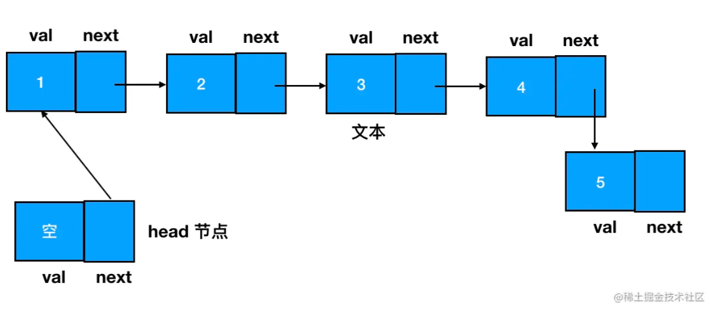
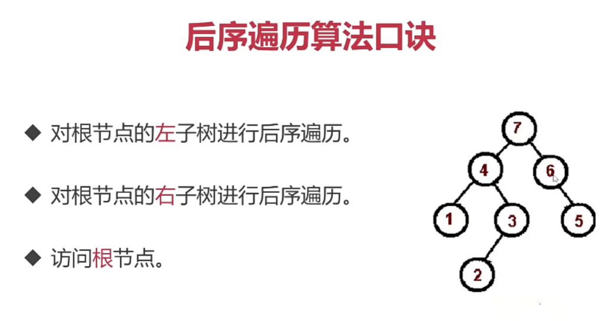
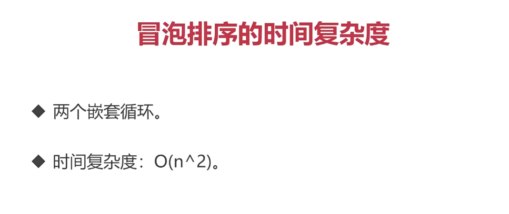
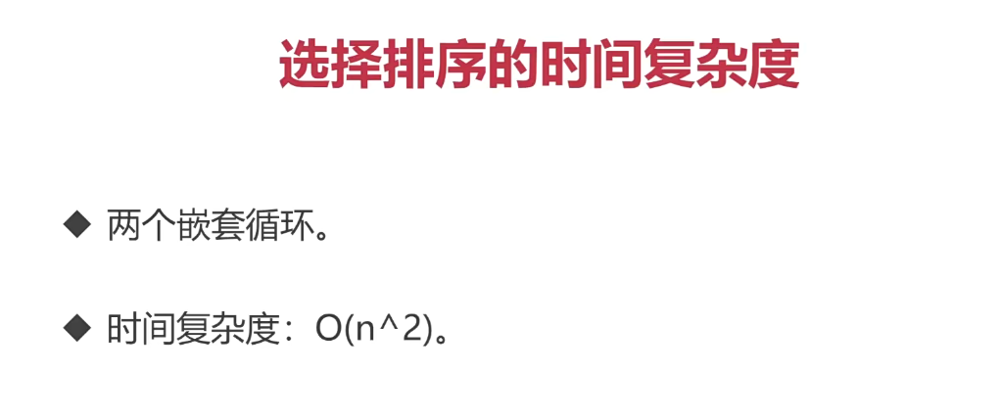
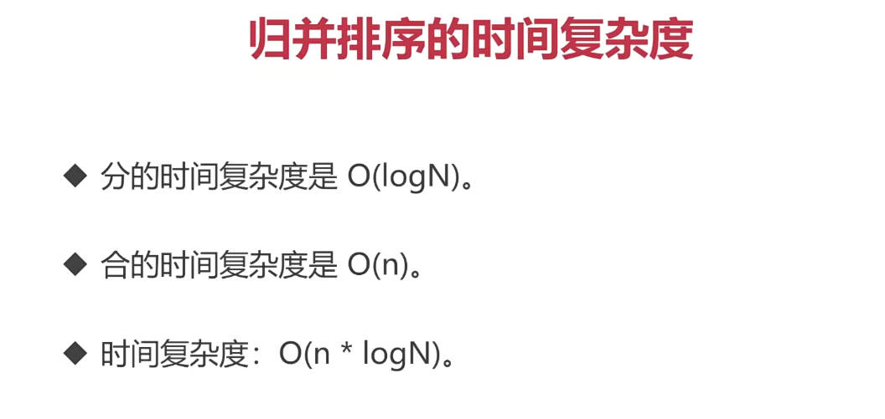
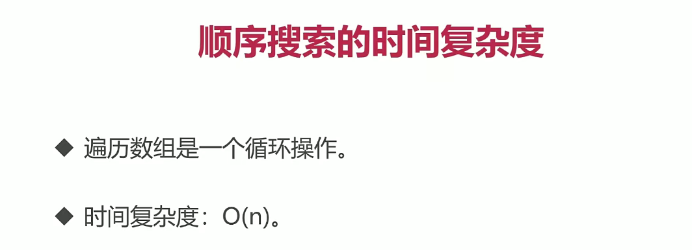
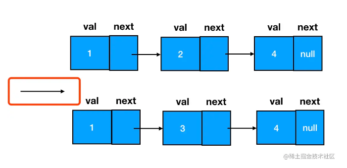
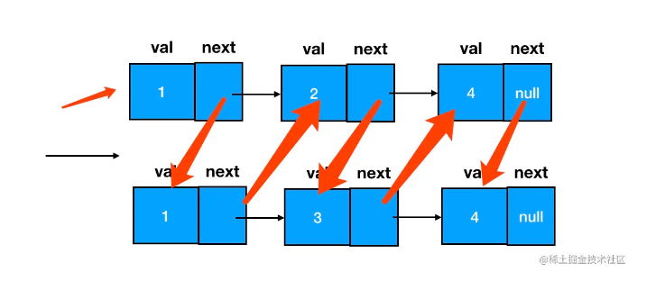
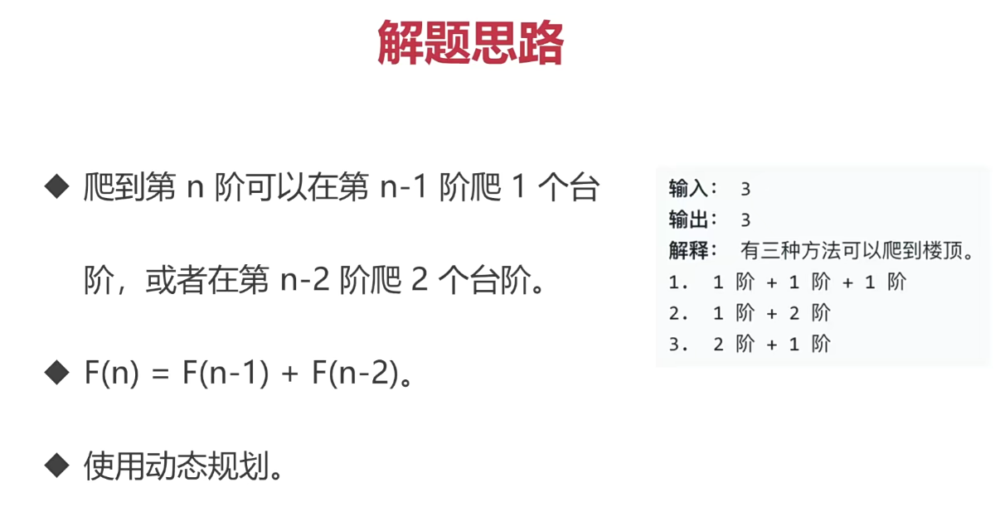

# 数据结构

## 数组

### 基本数组

+ 数组创建方式

> ① `字面量方法`
>
> ~~~js
> const arr = [1, 2, 3, 4]
> ~~~
>
> ② `new Array 方法`  -----  `用途: 创建指定长度的数组`
>
> ~~~js
> const arr = new Array()
> const arr = new Array(7)
> ~~~

+ 数组初始化

> `fill 方法` ---- 与 new Array 搭配使用
>
> ~~~js
> const arr = (new Array(7)).fill(1)
> ~~~
>
> 

+ 数组访问和遍历

> **`for 循环`**
>
> ~~~js
> // 获取数组的长度
> const len = arr.length
> for(let i=0;i<len;i++) {
>     // 输出数组的元素值，输出当前索引
>     console.log(arr[i], i)
> }
> ~~~
>
> **`forEach 方法`**
>
> ~~~js
> arr.forEach((item, index) => {
>     // 输出数组的元素值，输出当前索引
>     console.log(item, index)
> })
> ~~~
>
> **`map 方法`**
>
> ~~~js
> const newArr = arr.map((item, index)=> {
>     // 输出数组的元素值，输出当前索引
>     console.log(item, index)
>     // 在当前元素值的基础上加1
>     return item+1
> })
> ~~~
>
> ---
>
> `从性能上看，for 循环遍历起来是最快的`

### 二维数组

> 在数学中，形如这样**`长方阵列排列的复数或实数集合`**，被称为“`矩阵`”。因此二维数组的别名就叫“矩阵”。
>
> JS中，“`矩阵`”和“`二维数组`”之间是等价关系

+ 示例

> ~~~js
> const arr = [
>   [1,2,3,4,5],
>   [1,2,3,4,5],
>   [1,2,3,4,5],
>   [1,2,3,4,5],
>   [1,2,3,4,5]
> ]
> ~~~
>
> 

+ 二维数组初始化

> `fill 给二维数组初始化值具有局限性`
>
> fill 初始化存值相当于 用一个`值`给 多项数据赋值，如果这个值为引用类型，则会联动修改，本质上还是引用的同一个对象
>
> 给 fill 传递一个入参时，如果这个入参的类型是引用类型，那么 fill 在填充坑位时填充的其实就是入参的引用。
>
> ---
>
> 正确方法：for循环
>
> ~~~js
> const len = arr.length
> for(let i=0;i<len;i++) {
>     // 将数组的每一个坑位初始化为数组
>     arr[i] = []
> }
> ~~~

+ 访问二维数组

> 两层for循环遍历
>
> ~~~js
> // 缓存外部数组的长度
> const outerLen = arr.length
> for(let i=0;i<outerLen;i++) {
>     // 缓存内部数组的长度
>     const innerLen = arr[i].length
>     for(let j=0;j<innerLen;j++) {
>         // 输出数组的值，输出数组的索引
>         console.log(arr[i][j],i,j)
>     }
> }
> ~~~

+ 访问多维数组

> 三维数组就是三层。依次类推，**`N 维数组需要 N 层循环来完成遍历`**。

---

## 栈和队列

### 栈、队列 --- 特殊数组

> 栈和队列的实现一般都要依赖于数组
>
> 栈和队列都是运算受限的**`线性表`**
>
> 栈和队列的区别在于： 它们各自对数组的**`增删操作`**有着不一样的限制。

### 数组中的增删操作

> - unshift 方法-添加元素到数组的头部
>
> ~~~js
> const arr = [1,2]
> arr.unshift(0) // [0,1,2]
> ~~~
>
> - shift 方法-删除数组头部的元素
>
> ~~~js
> const arr = [1,2,3]
> arr.shift() // [2,3]
> ~~~
>
> - push 方法-添加元素到数组的尾部
>
> ~~~js
> const arr = [1,2]
> arr.push(3) // [1,2,3]
> 
> ~~~
>
> - pop 方法-删除数组尾部的元素
>
> ~~~js
> const arr = [1,2,3]
> arr.pop() // [1,2]
> ~~~
>
> - splice 方法-添加元素到数组的任何位置 (也可以`用于增删`元素)
>
>   splice有三个参数：`第一个`表示操作开始的`下标`，`第二个`表示需要操作的`元素个数`，`第三个`表示需要`传入的元素`
>
>   > splice 用于删除
>   >
>   > ~~~js
>   > arr.splice(1,1)
>   > ~~~
>   >
>   > 第一个入参是起始的索引值，第二个入参表示从起始索引开始需要删除的元素个数。
>   >
>   > ---
>   >
>   > splice 用于新增
>   >
>   > ~~~js
>   > arr.splice(1,0,3) // [1,3,2]
>   > ~~~
>   >
>   > 

### 栈（Stack）—  只用 pop 和 push 完成增删的“数组”

> - 只允许从尾部添加元素
> - 只允许从尾部取出元素

~~~js
// 初始状态，栈空
const stack = []  
// 入栈过程
stack.push('东北大板')
stack.push('可爱多')
stack.push('巧乐兹')
stack.push('冰工厂')
stack.push('光明奶砖')

// 出栈过程，栈不为空时才执行
while(stack.length) {
    // 单纯访问栈顶元素（不出栈）
    const top = stack[stack.length-1]
    console.log('现在取出的冰淇淋是', top)  
    // 将栈顶元素出栈
    stack.pop()
}

// 栈空
stack // []
~~~

### 队列（Queue）—  只用 push 和 shift 完成增删的“数组”

> - 只允许从尾部添加元素
> - 只允许从头部移除元素

~~~js
const queue = []  
queue.push('小册一姐')
queue.push('小册二姐')
queue.push('小册三姐')  
  
while(queue.length) {
    // 单纯访问队头元素（不出队）
    const top = queue[0]
    console.log(top,'取餐')
    // 将队头元素出队
    queue.shift()
}

// 队空
queue // []
~~~

## 链表

> 链表和数组相似:
>
> + 都是有序的列表
> + 都是线性结构（`有且仅有一个前驱、有且仅有一个后继`）
>
> ---
>
> 区别：
>
> 链表中，数据单位的名称叫做“结点”，而结点和结点的分布，在内存中可以是**`离散`**的。
>
> + 数组：
>
>   数组在内存中最为关键的一个特征，就是它一般是对应一段位于自己上界和下界之间的、一段**`连续`**的内存空间。
>
>   
>
> + 链表：
>
>   链表中的结点，则允许散落在内存空间的各个角落里。
>
>   

### 链表元素之间的关联建立

> 在链表中，每一个结点的结构都包括了两部分的内容：`数据域`和`指针域`。
>
> 数据域存储的是当前结点所存储的数据值，而指针域则代表下一个结点（后继结点）的引用。
>
> 
>
> 
>
> 为了确保起点结点是可抵达的，我们有时还会设定一个 head 指针来专门指向链表的开始位置
>
> 

### 链表节点的创建

> 创建链表结点，咱们需要一个构造函数：
>
> 在使用构造函数创建结点时，传入 val （数据域对应的值内容）、指定 next （下一个链表结点）
>
> ~~~js
> function ListNode(val) {
>     this.val = val;
>     this.next = null;
> }
> 
> const node = new ListNode(1)  
> node.next = new ListNode(2)
> ~~~
>
> 

### 链表元素的添加

> 尾部添加节点
>
> 
>
> 中间插入节点
>
> 需要变更的是**`前驱结点`**和**`目标结点`**的 next 指针指向
>
> ~~~js
> // 如果目标结点本来不存在，那么记得手动创建
> const node3 = new ListNode(3)     
> // 把node3的 next 指针指向 node2（即 node1.next）
> node3.next = node1.next
> // 把node1的 next 指针指向 node3
> node1.next = node3
> ~~~
>
> 

### 链表元素的删除

> 删除的标准是：在链表的遍历过程中，无法再遍历到某个结点的存在。
>
> 要想遍历不到 node3，我们直接让它的前驱结点 node1 的 next 指针跳过它、指向 node3 的后继即可。node3 就成为了一个完全不可抵达的结点了，它`会被 JS 的垃圾回收器自动回收`掉。
>
> ~~~js
> node1.next = node3.next 
> ~~~
>
> 
>
> 在涉及`链表删除`操作的题目中，`重点`不是定位目标结点，而是**`定位目标结点的前驱结点`**。
>
> ~~~js
> // 利用 node1 可以定位到 node3
> const target = node1.next  
> node1.next = target.next
> ~~~
>
> 

### 链表和数组的辨析

+ 纯数组

> `纯数字数组`
>
> 在大多数的计算机语言中，数组都对应着一段`连续的内存`
>
> 假设数组的长度是 n，那么因增加/删除操作导致需要移动的元素数量，就会随着数组长度 n 的增大而增大，呈一个线性关系。所以说数组增加/删除操作对应的复杂度就是 O(n)。
>
> ---
>
> `JS不一定是纯数字数组`
>
> 如果定义不同类型的元素，对应的就是一段非连续的内存，JS 数组不再具有数组的特征，其底层使用哈希映射分配内存空间，是由对象链表来实现的。

+ 数组和链表的区别

> `链表的插入/删除效率较高，而访问效率较低`
>
> ---
>
> `数组的访问效率较高，而插入效率较低`
>
> + 高效的增删操作 
> + 麻烦的访问操作

## 树

### 树结构图

抽象后的树结构

计算机中的树结构

### 基本概念

#### `树的层次计算规则`

> 根结点所在的那一层记为第一层，其子结点所在的就是第二层，以此类推。

#### `结点和树的“高度”计算规则`

> 叶子结点高度记为1，每向上一层高度就加1，逐层向上累加至目标结点时，所得到的的值就是目标结点的高度。树中结点的最大高度，称为“树的高度”。

#### `“度”的概念`

> 一个结点开叉出去多少个子树，被记为结点的“度”。比如我们上图中，根结点的“度”就是3。

#### `叶子结点`

> 叶子结点就是度为0的结点。在上图中，最后一层的结点的度全部为0，所以这一层的结点都是叶子结点。

### 二叉树结构

> - 它可以`没有根结点，作为一棵空树存在`
>
> - 如果它不是空树，那么**`必须由根结点、左子树和右子树组成，且左右子树都是二叉树`**。如下图：
>
>   
>
>   ---
>
>   二叉树不能被简单定义为每个结点的度都是2的树，它的左右子树的位置是严格约定、不能交换的。

`实现二叉树`

> 在 JS 中，二叉树使用对象来定义。它的结构分为三块：
>
> - 数据域
> - 左侧子结点（左子树根结点）的引用
> - 右侧子结点（右子树根结点）的引用
>
> ---
>
> 定义二叉树构造函数时，我们需要把左侧子结点和右侧子结点都预置为空
>
> 新建一个二叉树结点时，直接调用构造函数、传入数据域的值就行了
>
> ~~~js
> // 二叉树结点的构造函数
> function TreeNode(val) {
>     this.val = val;
>     this.left = this.right = null;
> }
> 
> const node  = new TreeNode(1)
> ~~~
>
> 得到一个值为 1 的二叉树结点
>
> 
>
> 通过给 left/right 赋值拓展其子树信息，延展出一棵二叉树
>
> 

# 复杂度

## 时间复杂度

> 算法的时间复杂度，它反映的不是算法的逻辑代码到底被执行了多少次，而是随着输入规模的增大，`算法对应的执行总次数的一个变化趋势`。
>
> 常见的时间复杂度按照从小到大的顺序排列，有以下几种
>
> 

### 示例

----

## 空间复杂度

> 空间复杂度是对一个算法在运行过程中临时占用存储空间大小的量度。和时间复杂度相似，它是`内存增长的趋势`。

# 指针 / 双指针

## 双指针的应用场景

> 一方面，它可以做到空间换时间
>
> 另一方面，它也可以帮我们降低问题的复杂度。

## 题目

### LC88 合并两个有序数组

`解题思路：`

> 首先我们定义两个指针，各指向两个数组生效部分的尾部
>
> 
>
> 每次只对指针所指的元素进行比较。取其中较大的元素，把它从 nums1 的末尾往前面填补。
>
> 
>
> 为什么是从后往前填补？
>
> nums1前面有已经占用的值，后面为空坑位，从后往前填值会减少挪动值的次数。
>
> ---
>
> 注意：
>
> + 如果提前遍历完的是 nums1 的有效部分，剩下的是 nums2。直接把 nums2 整个补到 nums1 前面去。
> + 如果提前遍历完的是 nums2，剩下的是 nums1。由于容器本身就是 nums1，不必再做任何额外的操作。

~~~js
/**
 * @param {number[]} nums1
 * @param {number} m
 * @param {number[]} nums2
 * @param {number} n
 * @return {void} Do not return anything, modify nums1 in-place instead.
 */
var merge = function(nums1, m, nums2, n) {
    // 定义两个指针分别指向两个数组的有效值的尾部
    let p1 = m-1
    let p2 = n-1
    // 定义初始化坑位位置 --- nums1的全数组长度的尾部
    let i = m + n -1
    while (p1 >= 0 && p2 >= 0) {
        if (nums1[p1] < nums2[p2]) {
            nums1[i] = nums2[p2]
            p2--
        } else {
            nums1[i] = nums1[p1]
            p1--
        }
        i--
    }
    // 如果nums1中没有值了，nums2中还有值，将剩下的值遍历插到nums1头部
    while(p2 >= 0){
        nums1[i] = nums2[p2]
        p2--
        i--
    }
     
};
~~~

### LC15 三数之和

`解题思路：`

> 三数之和延续两数之和的思路：可以把`求和问题变成求差问题`——固定其中一个数，在剩下的数中寻找是否有两个数和这个固定数相加是等于0的。
> 注意：双指针法用在涉及求和、比大小类的数组题目里时，`大前提`往往是：`该数组必须有序`。
>
> ---
>
> 对数组进行遍历，每次遍历到哪个数字，就固定哪个数字。
>
> 在该数字后面的剩下的数组中添加两个指针，分别指向剩下的数组的两端，每次移动指针计算两个指针值相加的值与固定数字的和：
>
> + 相加之和大于0， 得到目标组合
> + 相加之和大于0，说明右侧的数偏大了，右指针左移
> + 相加之和小于0，说明左侧的数偏小了，左指针右移
>
> ---
>
> 注意：题目中要求“不重复的三元组”
>
> ---
>
> 总结：
>
> `“对撞指针”法` ： 左右指针一起从两边往中间位置相互迫近，这样的特殊双指针形态
> 使用该方法的场景：遇到两个关键字——`“有序”和“数组”`
>
> 即便原数组不是有序的，也可以使用sort手动排序

~~~js
/**
 * @param {number[]} nums
 * @return {number[][]}
 */
var threeSum = function(nums) {
    let res = []
    let len = nums.length
    nums = nums.sort((a, b) => {
        return a - b
    })
 
    for (let i = 0; i < len-2; i++){
        // 如果nums[i]大于0,则三数之和必然无法等于0,结束循环
        if (nums[i] > 0) { continue }
        // 如果遍历范围内所有值都为正或者都为负，则三数之和必然无法等于0,结束循环
        if (nums[i]*nums[len - 1] > 0) { continue }
        // 如果nums[i] == mums[i- 1]， 则说明该数字重复,会导致结果重复，所以应该跳过
        if (i>0 && nums[i] === nums[i- 1]) {
            continue
        }
        let l = i+1
        let r = len-1

        const target = 0 - nums[i]
        while(l < r){
            if (nums[l] + nums[r] === target) {
                const s = [nums[i], nums[l], nums[r]]
                res.push(s)
                l++
                r--
                // 处理左指针元素重复的情况
                while(l<r && nums[l] === nums[l-1]){
                    l++
                }
                // 处理右指针元素重复的情况
                while(l<r && nums[r] === nums[r+1]){
                    r--
                }
            } else if (nums[l] + nums[r] < target) {
                // 结果偏小，左指针向右移动
                l++
                // 处理左指针元素重复的情况 --- 仅需考虑与上次左指针指向的值是否相等（因为数组是升序的）
                while(l<r && nums[l] === nums[l-1]){
                    l++
                }
            } else {
                // 结果偏大，右指针向左移动
                r--
                // 处理右指针元素重复的情况
                while(l<r && nums[r] === nums[r+1]){
                    r--
                }
            }
        }
    }
    return res
};

~~~

### LC剑指offerⅡ 74合并区间

> 解题思路:
>
> 先根据各个子数组的头部进行排序，让其变成`有序数组`
>
> 从头开始，`逐个合并首尾有交集的区间`--- `前一个的尾部 >= 下一个的头部`

~~~js
/**
 * @param {number[][]} intervals
 * @return {number[][]}
 */

var merge = function(intervals) {
    // 定义结果数组
    const res = []
    // 缓存区间个数
    const len = intervals.length
    // 将所有区间按照第一个元素大小排序
    intervals.sort(function(a, b) {
        return a[0] - b[0]
    })
    // 处理区间的边界情况
    if(!intervals || !intervals.length) {
        return []
    }
    // 将第一个区间 （起始元素最小的区间） 推入结果数组 （初始化）
    res.push(intervals[0])
    // 按照顺序，逐个遍历所有区间
    for(let i=1; i<len; i++) {
        // 取结果数组中的最后一个元素，作为当前对比的参考
        prev = res[res.length -1]
        // 若满足交错关系（前一个的尾部 >= 下一个的头部）
        if(prev[1] >= intervals[i][0]) {
            prev[1] = Math.max(prev[1], intervals[i][1])
        } else {
            res.push(intervals[i])
        }
    }
    return res
};

~~~

# 字符串

## 常见场景

### 反转字符串

~~~js
// 反转字符串
const str = "juejin";
// 通过split -- reverse -- join 几个字符串API实现反转
const res = str.split("").reverse().join("");
~~~

### 判断字符串是否为回文

~~~js
// 回文字符串
function isPalindrome(str) {
  const reverseStr = str.split("").reverse().join("");
  return reverseStr === str;
}

console.log(isPalindrome("yessey"));
~~~

### 判断字符串是否对称

~~~js
// 对称字符串
function isSymmetrical(str) {
  const len = str.length;
  for (let i = 0; i < len / 2; i++) {
    if (str[i] !== str[len - 1 - i]) {
      return false;
    }
  }
  return true;
}

console.log(isSymmetrical("yessey"));
console.log(isSymmetrical("yesisey"));
console.log(isSymmetrical("yesrey"));
~~~

#### LC 剑指offerⅡ 019 最多删除一个字符得到回文

> 字符串题干中若有“回文”关键字 ，需考虑两个关键字——**`对称性`** 和 **`双指针`**

> 解题思路：
>
> 初始化指针，指向头部和尾部
>
> 
>
> 如果两个指针相等，则往内推进，如果指针不相等，则对左指针字符和右指针字符尝试进行“跳过”，看看区间在 `[left+1, right]` 或 `[left, right-1]` 的字符串是否回文
>
> 

~~~js
/**
 * @param {string} s
 * @return {boolean}
 */
const validPalindrome = function(s) {
    // 缓存字符串的长度
    const len = s.length

    // i、j分别为左右指针
    let i=0, j=len-1
    
    // 当左右指针均满足对称时，一起向中间前进
    while(i<j&&s[i]===s[j]) {
        i++ 
        j--
    }
    
    // 如果遍历完成发现对称字符串，那么也会进入以下判断，在isPalindrome中默认返回true
    // 尝试判断跳过左指针元素后字符串是否回文
    if(isPalindrome(i+1,j)) {
      return true
    }
    // 尝试判断跳过右指针元素后字符串是否回文
    if(isPalindrome(i,j-1)) {
        return true
    }
    
    // 工具方法，用于判断字符串是否回文
    function isPalindrome(st, ed) {
        while(st<ed) {
            if(s[st] !== s[ed]) {
                return false
            }
            st++
            ed--
        } 
        return true
    }
    
    // 默认返回 false
    return false 
};

~~~

### 字符串匹配 --- 正则表达式

#### LC211 添加与搜索单词 - 数据结构设计

>思路分析：
>
>要求字符串既可以被添加、又可以被搜索 --- 用 Map（或对象字面量来模拟 Map
>
>为了降低查找时的复杂度，考虑以字符串的长度为 key，相同长度的字符串存在一个数组
>
>search API 既可以搜索文字，又可以搜索正则表达式：
>
>+ 若是普通字符串，则直接去 Map 中查找是否有这个 key
>+ 若是正则表达式，则创建一个正则表达式对象，判断 Map 中相同长度的字符串里，是否存在一个能够与这个正则相匹配

~~~js
// 构造函数
var WordDictionary = function() {
    // 初始化一个对象字面量，承担Map的角色
    this.words = {}
};

/** 
 * @param {string} word
 * @return {void}
 */

// 添加字符串的方法
WordDictionary.prototype.addWord = function(word) {
    // 若该字符串对应长度的数组已经存在，则只做添加
    if (this.words[word.length]) {
        this.words[word.length].push(word)
    } else {
        // 若该字符串对应长度的数组还不存在，则先创建
        this.words[word.length] = [word]
    }
};

/** 
 * @param {string} word
 * @return {boolean}
 */

// 搜索字符串的方法
WordDictionary.prototype.search = function(word) {
    // 若该字符串长度在Map中对应的数组本不存在，则可判断该字符串不存在
    if (!this.words[word.length]) {
        return false
    }
    // 缓存目标字符串的长度
    const len = word.length
    // 如果字符串中不包含".", 那么一定是普通字符串
    if (!word.includes('.')) {
        return this.words[len].includes(word)
    }

    // 否则是正则表达式，要先创建正则表达式对象
    const reg = new RegExp(word)

    // 只要数组中有一个匹配正则表达式的字符串，就返回true
    return this.words[len].some((item) => {
        return reg.test(item)
    })
};

/**
 * Your WordDictionary object will be instantiated and called as such:
 * var obj = new WordDictionary()
 * obj.addWord(word)
 * var param_2 = obj.search(word)
 */
~~~

#### LC8 字符串转换整数 (atoi)

~~~js
/**
 * @param {string} s
 * @return {number}
 */

// 入参是一个字符串
const myAtoi = function(str) {
    // 编写正则表达式
    const reg = /\s*([-\+]?[0-9]*).*/
    // 得到捕获组
    const groups = str.match(reg)
    // 计算最大值
    const max = Math.pow(2, 31) - 1
    // 计算最小值
    const min = - max - 1
    // targetNum 用于存储转化出来的数字
    let targetNum = 0
    // 如果匹配成功
    if(groups) {
        // 尝试转化捕获到的结构
        targetNum = +groups[1]
        // 注意：即便成功，也可能出现非数字的情况，比如单一个"+"
        if(isNaN(targetNum)){
            // 不能进行有效的转换时，返回0
            targetNum = 0
        }
    }
    // 卡口判断
    if (targetNum > max) {
        return max
    } else if (targetNum < min) {
        return min
    }
    // 返回转换结果
    return targetNum
};
~~~

# 栈

一个后进先出的数据结构

JavaScript中没有栈，但可以用Array实现栈的所有功能

## 栈的应用场景

JS中函数调用堆栈的示例

## 题目

### LC20 有效的括号

~~~js
/**
 * @param {string} s
 * @return {boolean}
 */
var isValid = function(s) {
    // 新建一个栈
    const stack = []
    // 遍历字符串
    for (let i = 0; i<s.length ; i++){
        // 当前字符
        const c = s[i]
        if (c === "(" || c === "{" || c === "["){
            // 遇见左括号就入栈（三种括号）
            stack.push(c)
        } else {
            // 遇见右括号，判断是否与栈顶值相等，如果相等，则栈顶出栈
            // 栈顶值
            const t = stack[stack.length -1]
            if(
                (t === "(" && c === ")") ||
                (t === "{" && c === "}") ||
                (t === "[" && c === "]")
            ){
                stack.pop()
            } else {
                return false
            }
        }
    }
    // 如果遍历完成之后都没有报错，则判断栈内是否为空，为空则证明合法
    return stack.length === 0
};
~~~

### LC38 每日温度问题

> 栈结构可以帮我们避免重复操作。避免重复操作的秘诀就是及时地将不必要的数据出栈，避免它对我们后续的遍历产生干扰。
>
> 解题思路：`维持一个递减栈`
>
> 当遍历过的温度，维持的是一个单调递减的态势时，我们就对这些温度的索引下标执行入栈操作；只要出现了一个数字，它打破了这种单调递减的趋势，也就是说它比前一个温度值高，这时我们就对前后两个温度的索引下标求差，得出前一个温度距离第一次升温的目标差值。

~~~js
/**
 * @param {number[]} temperatures
 * @return {number[]}
 */
var dailyTemperatures = function(temperatures) {
    const len = temperatures.length
    // 初始化一个栈
    const stack = []
    // 初始化结果数组，注意数组定长，占位为0
    const res = (new Array(len)).fill(0)
    for(let i = 0; i < len; i++){
        // 若栈不为0，且存在打破递减趋势的温度值
        while(stack.length && temperatures[i] > temperatures[stack[stack.length - 1]]){
            // 将栈顶温度值对应的索引出栈
            const top = stack.pop()
            // 计算 当前栈顶温度值与第一个高于它的温度值 的索引差值
            res[top] = i - top
        }
        // 注意栈里存的不是温度值，而是索引值，这是为了后面方便计算
        stack.push(i)
    }
    // 返回结果数组
    return res
};
~~~

### LC155 最小栈

`基本方法`

~~~js
// 初始化栈结构
var MinStack = function() {
    this.stack = []
};

/** 
 * @param {number} val
 * @return {void}
 */

// 栈的入栈操作 --- 数组的push方法
MinStack.prototype.push = function(val) {
    this.stack.push(val)
};

/**
 * @return {void}
 */

// 栈的出栈操作 --- 数组的pop方法
MinStack.prototype.pop = function() {
    this.stack.pop()
};

/**
 * @return {number}
 */

// 获取栈顶元素（最好做一下边界判断）
MinStack.prototype.top = function() {
    if(!this.stack || !this.stack.length) {
        return
    }
    return this.stack[this.stack.length - 1]
};

/**
 * @return {number}
 */

// 按照一次遍历的思路取最小值
MinStack.prototype.getMin = function() {
    let minValue = Infinity
    const {stack} = this
    for (let i = 0; i<stack.length; i++){
        if(stack[i] < minValue) {
            minValue = stack[i]
        }    
    }
    return minValue
};

/**
 * Your MinStack object will be instantiated and called as such:
 * var obj = new MinStack()
 * obj.push(val)
 * obj.pop()
 * var param_3 = obj.top()
 * var param_4 = obj.getMin()
 */
~~~

`递减栈方法`

> 优化思路：增加辅助栈（递减栈），维持栈顶始终为最小存入值
>
> 用空间换时间

~~~js
// 初始化栈结构
var MinStack = function() {
    this.stack = []
    // 定义辅助栈
    this.stack2 = []
};

/** 
 * @param {number} val
 * @return {void}
 */

// 栈的入栈操作 --- 数组的push方法
MinStack.prototype.push = function(val) {
    this.stack.push(val)
    // 若入栈的值小于当前最小值，则推入辅助栈栈顶
    if(this.stack2.length == 0 || val <= this.stack2[this.stack2.length - 1]){
        this.stack2.push(val)
    }
};

/**
 * @return {void}
 */

// 栈的出栈操作 --- 数组的pop方法
MinStack.prototype.pop = function() {
    // 若出栈的值和当前最小值相等，那么辅助栈也要对栈顶元素进行出栈，确保最小值的有效性
    if(this.stack.pop() == this.stack2[this.stack2.length - 1])
    this.stack2.pop()
};

/**
 * @return {number}
 */

// 获取栈顶元素（最好做一下边界判断）
MinStack.prototype.top = function() {
    return this.stack[this.stack.length - 1]
};

/**
 * @return {number}
 */

// 按照一次遍历的思路取最小值
MinStack.prototype.getMin = function() {
    // 辅助栈的栈顶，存的就是目标中的最小值
    return this.stack2[this.stack2.length - 1]
};

/**
 * Your MinStack object will be instantiated and called as such:
 * var obj = new MinStack()
 * obj.push(val)
 * obj.pop()
 * var param_3 = obj.top()
 * var param_4 = obj.getMin()
 */
~~~

## 技术要点

# 队列

## 应用场景

## 题目

### LC933 最近的请求次数

~~~js
var RecentCounter = function() {
    // 把队列q添加到this上，这样就能在所有的类方法上访问q
    this.q = []
};

/** 
 * @param {number} t
 * @return {number}
 */

// ping为类方法
RecentCounter.prototype.ping = function(t) {
    // 新请求入列
    this.q.push(t)
    while (this.q[0] < t -3000){
        // 将到时间的值出列，循环操作，知道没有需要出列的值
        this.q.shift()
    }
    return this.q.length
};

/**
 * Your RecentCounter object will be instantiated and called as such:
 * var obj = new RecentCounter()
 * var param_1 = obj.ping(t)
 */
~~~

>时间复杂度 On
>
>空间复杂度 On

### LC232 用栈实现队列

> `栈向队列转化`
>
> 解题思路：
>
> 让栈底的元素首先被取出，也就是让出栈序列被逆序
>
> 用两个栈来实现：
>
> + 入栈：值进入stack1
> + 出栈：将stack1的值出栈到stack2，再从stack2出栈

~~~js
var MyQueue = function() {
    // 初始化两个栈
    this.stack1 = []
    this.stack2 = []
};

/** 
 * @param {number} x
 * @return {void}
 */
MyQueue.prototype.push = function(x) {
    // 直接调度数组的push方法
    this.stack1.push(x)
};

/**
 * @return {number}
 */
MyQueue.prototype.pop = function() {
    // 假如stack2为空，需要将stack1的元素转移进来
    if(this.stack2.length <= 0){
        // 当stack1不为空时，出栈
        while(this.stack1.length !== 0){
            // 将stack1出栈的元素推入stack2
            this.stack2.push(this.stack1.pop())
        }
    }
    // 为了达到逆序的目的，我们只从stack2里出栈元素
    return this.stack2.pop()
};

/**
 * @return {number}
 */
MyQueue.prototype.peek = function() {
    if(this.stack2.length <= 0) {
        // 当 stack1 不为空时，出栈
        while(this.stack1.length != 0){
            // 将 stack1 出栈的元素推入 stack2
            this.stack2.push(this.stack1.pop())
        }
    }
    // 缓存 stack2 的长度
    const len2 = this.stack2.length
    return len2 && this.stack2[len2 - 1]
};

/**
 * @return {boolean}
 */
MyQueue.prototype.empty = function() {
    // 若 stack1 和 stack2 均为空，那么队列空
    return !this.stack1.length && !this.stack2.length   
};

/**
 * Your MyQueue object will be instantiated and called as such:
 * var obj = new MyQueue()
 * obj.push(x)
 * var param_2 = obj.pop()
 * var param_3 = obj.peek()
 * var param_4 = obj.empty()
 */
~~~

### LC 剑指offer59 滑动窗口的最大值

>`双端队列`： 允许在队列的两端进行插入和删除的队列
>
>解题思路：
>
>+ 定义一个 `left` 左指针、定义一个 `right` 右指针，分别指向窗口的两端
>+ 取出当前范围的所有元素、遍历一遍求出最大值，然后将最大值存进结果数组
>+ 滑动窗口直到移动到最右端

`方法一`

~~~js
/**
 * @param {number[]} nums
 * @param {number} k
 * @return {number[]}
 */
var maxSlidingWindow = function(nums, k) {
    let l = 0
    let r = k - 1
    const res = []
    const len = nums.length
    while(r <= len - 1){
        let tempMax = nums[l]
        for (let i = l; i <= r; i++){
            if(nums[i] >= tempMax){
                tempMax = nums[i]
            }
        }
        res.push(tempMax)
        l++
        r++
    }
    return res
};
~~~

`方法二：单独封装求最大值函数`

~~~js
/**
 * @param {number[]} nums
 * @param {number} k
 * @return {number[]}
 */
const maxSlidingWindow = function (nums, k) {
  // 缓存数组的长度
  const len = nums.length;
  // 定义结果数组
  const res = [];
  // 初始化左指针
  let left = 0;
  // 初始化右指针
  let right = k - 1;
  // 当数组没有被遍历完时，执行循环体内的逻辑
  while (right < len) {
    // 计算当前窗口内的最大值
    const max = calMax(nums, left, right);
    // 将最大值推入结果数组
    res.push(max);
    // 左指针前进一步
    left++;
    // 右指针前进一步
    right++;
  }
  // 返回结果数组
  return res;
};

// 这个函数用来计算最大值
function calMax(arr, left, right) {
  // 处理数组为空的边界情况
  if (!arr || !arr.length) {
    return;
  }
  // 初始化 maxNum 的值为窗口内第一个元素
  let maxNum = arr[left];
  // 遍历窗口内所有元素，更新 maxNum 的值
  for (let i = left; i <= right; i++) {
    if (arr[i] > maxNum) {
      maxNum = arr[i];
    }
  }
  // 返回最大值
  return maxNum;
}
~~~

`方法三：双端队列法`

> 如何将时间复杂度从 `O(kn)` 变为 `O(n)` ？
>
> 突破点：如何获得最大值
>
> + 一般方法：通过遍历来更新最大值
>
> + 进阶方法：双端队列法
>
>   在窗口发生移动时，只根据发生变化的元素对最大值进行更新 
>
>   核心思路：维护一个`有效的递减队列`

## 技术要点

# 链表

## 数组与链表的对比

## JS中的链表

### 链表相关操作: 遍历、插入、删除

~~~js
const a = { val: 'a' }
const b = { val: 'b' }
const c = { val: 'c' }
const d = { val: 'd' }
a.next = b
b.next = c
c.next = d

// 遍历链表
let p = a 
while (p) {
    console.log(p.val)
    p = p.next
}

// 插入
const e = { val: 'e' }
c.next = e
e.next = d

// 删除
c.next = d
~~~

## 题目

> 链表相关的题型可以分为三类：
>
> - 链表的处理：合并、删除等
> - 链表的反转及其衍生题目
> - 链表成环问题及其衍生题目

### [LC237 删除链表中的节点](https://leetcode.cn/problems/delete-node-in-a-linked-list/)

> 难点：无法获取需要删除的节点的上个节点

~~~js
/**
 * Definition for singly-linked list.
 * function ListNode(val) {
 *     this.val = val;
 *     this.next = null;
 * }
 */
/**
 * @param {ListNode} node
 * @return {void} Do not return anything, modify node in-place instead.
 */
var deleteNode = function(node) {
    // 将下个节点的值赋值给当前节点
    node.val = node.next.val
    // 删除下个节点
    node.next = node.next.next
};
~~~

> 时间复杂度： O1 
>
> 空间复杂度：O1

### LC82 删除排序链表中的重复元素 II

> 要删除某一个目标结点时，必须知道它的`前驱结点`。
>
> 但是如果第一个节点就存在重复，它没有前驱节点，则难以实现删除。
>
> 于是需要创造前驱节点 `dummy节点`   --- 链表中所有的结点都能确保有一个前驱结点
>
> 
>
> 如果想要删除两个连续重复的值为 1 的结点，我们只需要把 dummy 结点的 next 指针直接指向 2

~~~js
/**
 * Definition for singly-linked list.
 * function ListNode(val, next) {
 *     this.val = (val===undefined ? 0 : val)
 *     this.next = (next===undefined ? null : next)
 * }
 */
/**
 * @param {ListNode} head
 * @return {ListNode}
 */
var deleteDuplicates = function(head) {
    // 极端情况：0个或1个结点，则不会重复，直接返回
    if(!head || !head.next) {
        return head
    }
    // 定义虚拟头节点
    let dummy = new ListNode()
    // 虚拟节点指向链表第一个节点
    dummy.next = head
    // 定义指针---初始化指向虚拟节点
    let p = dummy
    // 当指针后面至少有两个节点时
    while(p.next && p.next.next){
        // 对指针后面的两个结点进行比较
        if (p.next.val === p.next.next.val){
            // 若值重复，则记下这个值
            let num = p.next.val
            // 反复地排查后面的元素是否存在多次重复该值的情况
            while(p.next && p.next.val === num){
                // 如果有，则删除
                p.next = p.next.next
            }
        } else {
            // 若不重复，则正常遍历
            p = p.next
        }
    }
    return dummy.next
};
~~~

### LC206 反转链表

~~~js
/**
 * Definition for singly-linked list.
 * function ListNode(val, next) {
 *     this.val = (val===undefined ? 0 : val)
 *     this.next = (next===undefined ? null : next)
 * }
 */
/**
 * @param {ListNode} head
 * @return {ListNode}
 */
var reverseList = function(head) {
    // 新建快和慢两个指针
    // 快指针
    let p1 = head 
    // 慢指针
    let p2 = null
    while(p1){
        const temp = p1.next
        p1.next = p2
        p2 = p1
        p1 = temp
    }
    return p2

};
~~~

>将数组转为列表：
>
>~~~js
>// 将数组转为链表
>function arrayToList(arr) {
>  if (arr.length === 0) return null;
>
>  let head = { val: arr[0], next: null };
>  let current = head;
>
>  for (let i = 1; i < arr.length; i++) {
>    const node = { val: arr[i], next: null };
>    current.next = node;
>    current = node;
>  }
>
>  return head;
>}
>
>let s = arrayToList([1, 2, 3, 4, 5]);
>
>var reverseList = function (head) {
>  // 新建快和慢两个指针
>  // 快指针
>  let p1 = head;
>  // 慢指针
>  let p2 = null;
>  while (p1) {
>    const temp = p1.next;
>    p1.next = p2;
>    p2 = p1;
>    p1 = temp;
>  }
>  return p2;
>};
>
>const t = reverseList(s);
>~~~
>
>

### LC91 反转链表 II

~~~js
/**
 * Definition for singly-linked list.
 * function ListNode(val, next) {
 *     this.val = (val===undefined ? 0 : val)
 *     this.next = (next===undefined ? null : next)
 * }
 */
/**
 * @param {ListNode} head
 * @param {number} left
 * @param {number} right
 * @return {ListNode}
 */

// 入参是头结点、left、right
var reverseBetween = function(head, left, right) {
    // 定义pre、cur,用LeftHead来承接整个区间的前驱结点
    let pre,cur,leftHead
    // dummy结点
    const dummy = new ListNode()
    dummy.next = head
    // 定义指针p，最初指向dummy
    let p = dummy
    // p往前走left-1步 --- 走到整个区间的前驱结点处
    for(let i = 0;i < left-1;i++){
        p = p.next
    }
    // 将前驱节点缓存
    leftHead = p
    // start 是反转区间的第一个结点
    let start = leftHead.next
    // pre 指向start
    pre = start
    // cur指向start的下一个结点
    cur = pre.next
    // 开始重复反转动作
    for(let i = left; i < right; i++){
        let next = cur.next
        cur.next = pre
        pre = cur
        cur = next
    }
    // leftHead 的后继结点为反转后的区间的第一个结点
    leftHead.next = pre
    // 将区间内反转后的最后一个结点next指向cur
    start.next = cur
    // dummy.next 永远指向链表头结点
    return dummy.next 
}
~~~

### LC2 两数相加

~~~js
/**
 * Definition for singly-linked list.
 * function ListNode(val, next) {
 *     this.val = (val===undefined ? 0 : val)
 *     this.next = (next===undefined ? null : next)
 * }
 */
/**
 * @param {ListNode} l1
 * @param {ListNode} l2
 * @return {ListNode}
 */
var addTwoNumbers = function(l1, l2) {
    // 新建空链表
    const l3 = new ListNode(0)
    let p1 = l1
    let p2 = l2
    let p3 = l3
    let carry = 0 // 保存需要进位的数值
    while (p1 || p2){
        // 有可能会出现 l1 和 l2 两个链表长度不一致的情况——需要给短链表的该项值赋值为0
        const v1 = p1 ? p1.val : 0
        const v2 = p2 ? p2.val : 0
        const val = v1 + v2 + carry
        carry = Math.floor(val/10) // 保存(更新)进位数
        p3.next = new ListNode(val % 10)
        // 需要判断两条链表是否还存在，如果还存在则向后移动指针
        if (p1) p1 = p1.next
        if (p2) p2 = p2.next
        p3 = p3.next 
    }
    if (carry){
        // 如果两条链表遍历完最后一个数时有进位
        p3.next = new ListNode(carry)
    }
    return l3.next
};
~~~

>时间复杂度：On
>
>空间复杂度：On

### LC83 删除排序链表中的重复元素

~~~js
/**
 * Definition for singly-linked list.
 * function ListNode(val, next) {
 *     this.val = (val===undefined ? 0 : val)
 *     this.next = (next===undefined ? null : next)
 * }
 */
/**
 * @param {ListNode} head
 * @return {ListNode}
 */
var deleteDuplicates = function(head) {
    let p = head
    while(p && p.next){
        if(p.val === p.next.val){
            p.next = p.next.next         
        } else {
            // 当不止一个重复元素时，需要判断下下个元素也不重复，才能后移指针
            p = p.next
        }
    }
    return head
};
~~~

>时间复杂度 On
>
>空间复杂度 O1

### LC141 环形链表

`flag法`

~~~js
/**
 * @param {ListNode} head
 * @return {boolean}
 */
// 入参是头结点 
const hasCycle = function(head) {
    // 只要结点存在，那么就继续遍历
    while(head){
        // 如果 flag 已经立过了，那么说明环存在
        if(head.flag){
            return true;
        }else{
            // 如果 flag 没立过，就立一个 flag 再往下走
            head.flag = true;
            head = head.next;
        }
    }
    return false;
};

~~~

`快慢指针法`

~~~js
/**
 * Definition for singly-linked list.
 * function ListNode(val) {
 *     this.val = val;
 *     this.next = null;
 * }
 */

/**
 * @param {ListNode} head
 * @return {boolean}
 */
 
var hasCycle = function(head) {
    // 定义一快一慢两个指针
    let p1 = head
    let p2 = head
    while (p1 && p2 && p2.next){
        // 慢指针一次走一步
        p1 = p1.next
        // 快指针一次走两步
        p2 = p2.next.next

        // 如果是环路，那么快慢指针终究会相遇
        if(p1 === p2){
            return true
        }
    }
    return false
};
~~~

>时间复杂度 ：On
>
>空间复杂度：O1

### LC 剑指 Offer II 022. 链表中环的入口节点

> 如果一个结点是环形链表成环的起点，那么它一定是第一个被发现 flag 标志已存在的结点
>
> 

~~~js
/**
 * Definition for singly-linked list.
 * function ListNode(val) {
 *     this.val = val;
 *     this.next = null;
 * }
 */

/**
 * @param {ListNode} head
 * @return {ListNode}
 */
var detectCycle = function(head) {
    while(head){
        if(head.flag){
            return head
        } else {
            head.flag = true
            head = head.next
        }
    }
    return null
};
~~~

### LC138 复制带随机指针的链表

> 思路分析：
>
> ① 本题要求深拷贝 
>
> ② 处理深拷贝过程中的节点关系 --- Map结构
>
> + 除了 `next` 指针还有 `random`指针，结点关系相对复杂
> + `Map`结构解决结点处理过程中的“根据原结点定位它对应的copy结点”这样的需求
>
> ③  `next`指针和`random`指针的处理流程
>
> + 先走一遍普通链表（没有`random`指针）的复制流程，一方面是完成对结点的`复制+存储`工作，另一方面也用`next`指针把新链表串了起来
>
> + **`同步遍历新旧两个链表`**，把 `random` 的指向映射到新链表上去

~~~js
/**
 * // Definition for a Node.
 * function Node(val, next, random) {
 *    this.val = val;
 *    this.next = next;
 *    this.random = random;
 * };
 */

/**
 * @param {Node} head
 * @return {Node}
 */
var copyRandomList = function(head) {
    // 处理边界条件
    if(!head) return null
    // 初始化copy的头部结点
    let copyHead = new Node()
    // 初始化copy的游标结点
    let copyNode = copyHead
    // 初始化hashMap
    const hashMap = new Map()
    let curr = head
    // 首次循环，正常处理链表的复制
    while(curr) {
        copyNode.val = curr.val
        copyNode.next = curr.next ? new Node() : null
        hashMap.set(curr, copyNode)
        curr = curr.next
        copyNode = copyNode.next
    }
    // 将游标复位到head
    curr = head
    // 将copy链表的游标也复位到copyHead
    copyNode = copyHead
    // 二次循环，特殊处理random关系
    while(curr) {
        // 处理random的指向
        copyNode.random = curr.random ? hashMap.get(curr.random) : null
        // copyNode 和 curr 两个游标一起前进
        copyNode = copyNode.next
        curr = curr.next
    }

    // 返回copyHead
    return copyHead
};
~~~

## 前端与链表：JS中的原型链

### JS中用Object模拟链表

~~~js
const obj = {};
const func = function () {};
const arr = [];

// 原型链查找
Object.prototype.x = "x";
Function.prototype.y = "y";

console.log(obj.x, obj.y); // x undefined
console.log(func.x, func.y); // x y
console.log(arr.x, arr.y); // x undefined

// 遍历原型链
const myInstanceOf = (A, B) => {
  let p = A;
  while (p) {
    if (p === B.prototype) {
      return true;
    }
    p = p.__proto__;
  }
  return false;
};

console.log(
  // true false false
  myInstanceOf(obj, Object),
  myInstanceOf(obj, Function),
  myInstanceOf(obj, Array)
);

console.log(
  // true true false
  myInstanceOf(func, Object),
  myInstanceOf(func, Function),
  myInstanceOf(func, Array)
);

console.log(
  // true false true
  myInstanceOf(arr, Object),
  myInstanceOf(arr, Function),
  myInstanceOf(arr, Array)
);
~~~

### 使用链表指针获取JSON的节点值

~~~js
const json = {
  a: { b: { c: 1 } },
  d: { e: 2 },
};

const path = ["a", "b", "c"];

let p = json;
path.forEach((k) => {
  p = p[k];
});
~~~

## 技术要点

# 集合

~~~js
// 去重
const arr = [1, 1, 2, 3, 3, 4];
const arr2 = [...new Set(arr)];

// 判断元素是否在集合中
const set = new Set(arr);
const has = set.has(3);

// 求交集
const set2 = new Set([2, 3]);
const set3 = new Set(
  [...set].filter((item) => {
    set2.has(item);
  })
);
~~~

## 题目

### LC349 两个数组的交集

~~~js
/**
 * @param {number[]} nums1
 * @param {number[]} nums2
 * @return {number[]}
 */
var intersection = function(nums1, nums2) {
    // 该方法性能较差，nums2没有必要转换成集合，可以用数组的原生方法
    // return [...new Set(nums1)].filter(n=> (new Set(nums2)).has(n))
    return [...new Set(nums1)].filter(n=> nums2.includes(n))
};
~~~

>时间复杂度 O(m×n)
>
>空间复杂度 O(m)

## 前端与集合

~~~js
let mySet = new Set();

// 添加
mySet.add(1);
mySet.add(5);
mySet.add(5);
mySet.add("some text");
let o = { a: 1, b: 2 };
mySet.add(o);
mySet.add({ a: 1, b: 2 });

// 包含
const has = mySet.has(o);

// 删除
mySet.delete(5);

// 遍历集合
// 方法①
for (let item of mySet.keys()) console.log(item);
// 方法②
// 集合的key和value是一样的
for (let [key, value] of mySet.entries()) console.log(key, value);

// 将集合转换为数组
const myArr1 = [...mySet];
const myArr2 = Array.from(mySet);

// 将数组转换为集合
const mySet2 = new Set([1, 2, 3, 4]);

// 求集合的交集
// 转换为数组，利用数组的方法
const intersection = new Set([...mySet].filter((x) => mySet2.has(x)));

// 求集合的差集
const difference = new Set([...mySet].filter((x) => !mySet2.has(x)));
~~~

# 字典

~~~js
const m = new Map();

// 增
m.set("a", "aa");
m.set("b", "bb");

// 查
m.get("a");
m.get("b");

// 删
m.delete("b");

// 清空
// m.clear();

// 改
m.set("a", "aaa");

~~~

## 题目

### LC349 两个数组的交集（字典版）

~~~js
/**
 * @param {number[]} nums1
 * @param {number[]} nums2
 * @return {number[]}
 */
var intersection = function(nums1, nums2) {
    const map = new Map()
    // 将nums1转为字典
    nums1.forEach(n=>{
        map.set(n,true)
    })
    const res = []
    nums2.forEach(n=>{
        if(map.get(n)){
            // 遍历nums2，如果遇到和字典中相同的值，则存入新数组中，且立即删除字典中该项数据
            res.push(n)
            map.delete(n)
        }
    })
    return res
};
~~~

>时间复杂度 O(m+n)
>
>空间复杂度 Om

### LC20 有效的括号（优化）

~~~js
/**
 * @param {string} s
 * @return {boolean}
 */
var isValid = function(s) {
    // 新建一个栈
    const stack = []
    // 优化---字典方法
    const map = new Map()
    map.set('(',')')
    map.set('{','}')
    map.set('[',']')
    // 遍历字符串
    for (let i = 0; i<s.length ; i++){
        // 当前字符
        const c = s[i]
        if (map.has(c)){
            // 遇见左括号就入栈（三种括号）
            stack.push(c)
        } else {
            // 遇见右括号，判断是否与栈顶值相等，如果相等，则栈顶出栈
            // 栈顶值
            const t = stack[stack.length -1]
            if(map.get(t) === c){
                stack.pop()
            } else {
                return false
            }
        }
    }
    // 如果遍历完成之后都没有报错，则判断栈内是否为空，为空则证明合法
    return stack.length === 0
};
~~~

>时间复杂度 On
>
>空间复杂度 On

### LC1 两数之和

`字典方法`

~~~js
/**
 * @param {number[]} nums
 * @param {number} target
 * @return {number[]}
 */
var twoSum = function(nums, target) {
    // 新建一个字典用来记录值
    const map = new Map()
    for (let i = 0 ; i < nums.length ; i++){
        // 当前值
        const n = nums[i]
        // 当前值需要匹配的值
        const n2 = target - n
        if (map.has(n2)){
            // 在字典中查找是否有匹配的值
            // 如果有，则返回[匹配值索引，当前值索引]
            return [map.get(n2) , i]
        } else {
            // 如果没有匹配的值，则将值存在字典中 --- 载入系统
            map.set(n, i)
        }
    }
};
~~~

>时间复杂度 On
>
>空间复杂度 On

总结：

> 暴力解法：两层循环来遍历同一个数组；第一层循环遍历的值记为 a，第二层循环时遍历的值记为 b
>
> ---
>
> 优化技巧：`当发现自己的代码里有两层循环时，先反思一下，能不能用空间换时间，把它优化成一层循环。`
>
> ---
>
> 技巧总结： `几乎所有的求和问题，都可以转化为求差问题`

### LC3 无重复字符的最长子串

 

~~~js
/**
 * @param {string} s
 * @return {number}
 */
var lengthOfLongestSubstring = function(s) {
    // 定义 左l 右r 两个指针
    let l = 0
    // 定义最大不重复字符数
    let res = 0
    // 创建字典用来存储已经扫描过的字符串
    const map = new Map()
    for (let r = 0; r< s.length ; r++){
        if (map.has(s[r]) && map.get(s[r]) >= l){
            // 如果字典中有重复字符，且在当前滑动窗口内 --- 将左指针移动到重复元素后面
            l = map.get(s[r]) + 1
        }
        // 判断是否需要窗口的最大长度
        res = Math.max(res , r-l+1)
        // 将右指针扫描过的值存储在字典中
        map.set(s[r],r)
    }
    return res
};
~~~

>需考虑情况，右指针遇到重复字符时，但是上一个字符已经不在滑动窗口内部了
>
>

>时间复杂度 On
>
>空间复杂度 Om , m是字符串中不重复字符的个数

### LC76 最小覆盖字串

未通过版

~~~js
/**
 * @param {string} s
 * @param {string} t
 * @return {string}
 */
var minWindow = function(s, t) {
    // 定义滑动窗口左右指针
    let l = 0 
    let r = 0 
    // 建立字典用来存储目标字符串
    const need = new Map()
    for (let c of t){
        // 遍历目标字符串，存储目标子字符串key和该字符串的个数
        // 如果字典中已有该字符，则数量+1 ， 如果是首次，则数量设置为1
        need.set(c,need.has(c)? need.get(c)+1:1)
    }
    // 目标字符串字典的长度
    let needType = need.size
    // 定义结果变量
    let res = ''
    // 右指针一直向右滑动
    while(r < s.length){
        // 当前右指针的值
        const c = s[r]
        // 右指针向右滑动的过程中，如果遇到目标字符串，则需要更新字典数据（①字典中该项的数量 ②字典长度）
        if (need.has(c)){
            need.set(c,need.get(c)-1)
            if (need.get(c) === 0) needType -=1
        }
        // 滑动窗口中已经含有所有目标字符串时，则需要尝试移动左边指针，尝试减小窗口宽度
        while (needType === 0){
            // 截取满足需求的窗口内容
            const newRes = s.substring(l,r+1)
            // 如果当前窗口宽度小于历史记录，则更新结果  （首次得到结果直接赋值）
            if(!res || newRes.length < res.length) res = newRes
            // 当前左指针的值
            const c2 = s[l]
            // 移动左指针的过程中,如果发现滑走了一个目标子字符串,则需要更新字典数据（①字典中该项的数量 ②字典长度）
            if (need.has(c2)){
                need.set(c2,need.get(c2)+1)
                if (need.get(c2) === 1) needType += 1
            }
            l += 1
        }
        r += l
    }
    return res
};
~~~

>时间复杂度 O(m+n) m是t的长度，n是s的长度
>
>空间复杂度 O(m)

通过版

~~~js
/**
 * @param {string} s
 * @param {string} t
 * @return {string}
 */

const minWindow = (s, t) => {
  let minLen = s.length + 1;
  let start = s.length;     // 结果子串的起始位置
  let map = {};             // 存储目标字符和对应的缺失个数
  let missingType = 0;      // 当前缺失的字符种类数
  for (const c of t) {      // t为baac的话，map为{a:2,b:1,c:1}
    if (!map[c]) {
      missingType++;        // 需要找齐的种类数 +1
      map[c] = 1;
    } else {
      map[c]++;
    }
  }
  let l = 0, r = 0;                // 左右指针
  for (; r < s.length; r++) {      // 主旋律扩张窗口，超出s串就结束
    let rightChar = s[r];          // 获取right指向的新字符
    if (map[rightChar] !== undefined) map[rightChar]--; // 是目标字符，它的缺失个数-1
    if (map[rightChar] == 0) missingType--;   // 它的缺失个数新变为0，缺失的种类数就-1
    while (missingType == 0) {                // 当前窗口包含所有字符的前提下，尽量收缩窗口
      if (r - l + 1 < minLen) {    // 窗口宽度如果比minLen小，就更新minLen
        minLen = r - l + 1;
        start = l;                 // 更新最小窗口的起点
      }
      let leftChar = s[l];          // 左指针要右移，左指针指向的字符要被丢弃
      if (map[leftChar] !== undefined) map[leftChar]++; // 被舍弃的是目标字符，缺失个数+1
      if (map[leftChar] > 0) missingType++;      // 如果缺失个数新变为>0，缺失的种类+1
      l++;                          // 左指针要右移 收缩窗口
    }
  }
  if (start == s.length) return "";
  return s.substring(start, start + minLen); // 根据起点和minLen截取子串
};

~~~

# 树

## 树的常见操作

### 深度/广度优先遍历

#### 深度优先遍历

> DFS是递归实现，本质是`栈`
>
> 
>
> JS 会维护一个叫“函数调用栈”的东西，`preorder`每调用一次自己，相关调用的上下文就会被`push`进函数调用栈中；待函数执行完毕后，对应的上下文又会从调用栈中被`pop`出来。
>
> 部分题目要求记录每一层递归式里路径的状态，此时就会强依赖`栈结构`

~~~js
const tree = {
  val: "a",
  children: [
    {
      val: "b",
      children: [
        {
          val: "d",
          children: [],
        },
        {
          val: "e",
          children: [],
        },
      ],
    },
    {
      val: "c",
      children: [
        {
          val: "f",
          children: [],
        },
        {
          val: "g",
          children: [],
        },
      ],
    },
  ],
};

const dfs = (root) => {
  console.log(root.val);
  //   root.children.forEach((child) => dfs(child));
  root.children.forEach(dfs);
};

dfs(tree);
~~~

#### 广度优先遍历

> BFS是层序遍历，符合`队列`的数据结构
>
> 
>
> 分层遍历的过程：丢弃已访问的坐标、记录新观察到的坐标，顺序符合了“`先进先出`”的原则

~~~js
const tree = {
  val: "a",
  children: [
    {
      val: "b",
      children: [
        {
          val: "d",
          children: [],
        },
        {
          val: "e",
          children: [],
        },
      ],
    },
    {
      val: "c",
      children: [
        {
          val: "f",
          children: [],
        },
        {
          val: "g",
          children: [],
        },
      ],
    },
  ],
};

const bfs = (root) => {
    // 新建一个队列
    const q = [root]
    while (q.length > 0) {
        // 将根节点出列
        const n = q.shift()
        console.log(n.val)
        // 遍历根节点的子节点,将其入列
        n.children.forEach((child) => {
            q.push(child)
        })
    }
};

bfs(tree);

~~~

### 二叉树的先中后序遍历

#### 先序遍历

~~~js
const bt = {
    val: 1,
    left: {
        val: 2,
        left: {
            val: 4,
            left: null,
            right: null,
        },
        right: {
            val: 5,
            left: null,
            right: null,
        },
    },
    right: {
        val: 3,
        left: {
            val: 6,
            left: null,
            right: null,
        },
        right: {
            val: 7,
            left: null,
            right: null,
        },
    },
};

module.exports = bt;
~~~

~~~js
const bt = require("./bt");

const preorder = (root) => {
  // 如果根节点为null,无需遍历
  if (!root) {
    return;
  }
  console.log(root.val);
  //左
  preorder(root.left);
  // 右
  preorder(root.right);
};

preorder(bt);
~~~

`非递归版`

~~~js
const bt = require("./bt");

const preorder = (root) => {
  // 如果根节点为null,无需遍历
  if (!root) {
    return;
  }
  // 新建栈
  const stack = [root];
  // 如果栈中有值,则循环遍历
  while (stack.length) {
    // 访问根节点 --- 栈顶弹出的值即为所需根节点
    const n = stack.pop();
    console.log(n.val);
    // 右节点先入栈 --- 保证后出栈
    if (n.right) stack.push(n.right);
    // 左节点后入栈 --- 保证先出栈
    if (n.left) stack.push(n.left);
  }
};

preorder(bt);
~~~

~~~js
// 先序遍历（迭代法）
function preorederTraversal(root) {
  // 定义结果数组
  const res = [];
  // 处理边界条件
  if (!root) {
    return res;
  }
  // 初始化栈结构
  const stack = [];
  // 首先将根节点入栈
  stack.push(root);
  // 若栈不为空，则重复出栈、入栈操作
  while (stack.length) {
    // 栈顶结点为当前结点
    const cur = stack.pop();
    // 根节点入栈
    res.push(cur.val);
    // 为了保证正确输出顺序，在栈中需要逆序入栈，入栈顺序变成 --- 根右左
    // 若当前子树有右子树，则将右子树入栈
    if (cur.right) {
      stack.push(cur.right);
    }
    // 若当前子树有左子树，则将左子树入栈
    if (cur.left) {
      stack.push(cur.left);
    }
  }
  // 返回结果数组
  return res;
}
~~~

#### 中序遍历

~~~js
const bt = require("./bt");

const inorder = (root) => {
  if (!root) {
    return;
  }
  // 左
  inorder(root.left);
  // 根
  console.log(root.val);
  // 右
  inorder(root.right);
};

 inorder(bt) 
~~~

`非递归版`

~~~js
const bt = require("./bt");

const inorder = (root) => {
  if (!root) {
    return;
  }
  const res = []
  // 新建栈
  const stack = [];
  // 定义一个指针
  let p = root;
  // 判断栈中是否有左分支的存留值,否则将开始对右节点进行操作
  while (stack.length || p) {
    // 这个 while 的作用是把寻找最左叶子结点的过程中，途径的所有结点都记录下来  
    while (p) {
      // 根节点入栈
      stack.push(p);
      // 指针指向左节点
      p = p.left;
    }
    // 上面遍历完树的所有分支后,从最尖端处开始读取值
    const n = stack.pop();
    res.push(n.val)
    // 将指针指向右节点 --- 开始对所有右分支遍历
    p = n.right;
  }
};

inorder(bt);
~~~

#### 后序遍历

~~~js
const bt = require("./bt");

const postorder = (root) => {
  if (!root) {
    return;
  }
  // 左
  postorder(root.left);
  // 右
  postorder(root.right);
  // 根
  console.log(root.val);
};

postorder(bt);
~~~

`非递归版`

> 技巧：复用先序遍历
>
> 倒置后序遍历 ：左右根  ===》 根右左
> 复用先序遍历实现逆序访问： 根右左
> 定义一个倒置栈：倒序输出普通栈的值

~~~js
const bt = require("./bt");

const postorder = (root) => {
  if (!root) {
    return;
  }
  // 倒置栈
  const outputStack = [];
  //  复用先序遍历逻辑,仅修改左右节点顺序
  // 普通栈
  const stack = [root];
  // 如果栈中有值,则循环遍历
  while (stack.length) {
    // 访问根节点 --- 栈顶弹出的值即为所需根节点
    const n = stack.pop();
    //   原本访问节点的位置不访问,而是将值存在倒置栈中
    // console.log(n.val);
    outputStack.push(n.val);
    // 左节点先入栈 --- 保证后出栈 (顺序变化)
    if (n.left) stack.push(n.left);
    // 右节点后入栈 --- 保证先出栈 (顺序变化)
    if (n.right) stack.push(n.right);
  }
  // 完成遍历存值后,需要将倒置栈中的值输出
  while (outputStack.length) {
    const n = outputStack.pop();
    // 实现倒序输出值
    console.log(n.val);
  }
};

postorder(bt);
~~~

~~~js
// 后序遍历（迭代法）
function postorederTraversal(root) {
  // 定义结果数组
  const res = [];
  // 处理边界条件
  if (!root) {
    return res;
  }
  // 初始化栈结构
  const stack = [];
  // 首先将根节点入栈
  stack.push(root);
  // 若栈不为空，则重复出栈、入栈操作
  while (stack.length) {
    // 栈顶结点为当前结点
    const cur = stack.pop();
    // 当前结点就是当前子树的根结点，把这个结点放在结果数组的头部
    res.unshift(cur.val);
    // 为了保证正确输出顺序，需要从头部存入结果数组，顺序为 --- 根左右
    // 若当前子树有左子树，则将左子树入栈
    if (cur.left) {
      stack.push(cur.left);
    }
    // 若当前子树有右子树，则将右子树入栈
    if (cur.right) {
      stack.push(cur.right);
    }
  }
  // 返回结果数组
  return res;
}
~~~

## 二叉搜索树

> 二叉搜索树的递归定义：
>
> 1. 是一棵空树
> 2. 是一棵由根结点、左子树、右子树组成的树，同时左子树和右子树都是二叉搜索树，且**`左子树`**上所有结点的数据域都**`小于等于`**根结点的数据域，**`右子树`**上所有结点的数据域都**`大于等于`**根结点的数据域
>
> ---
>
> 叉搜索树强调的是**`数据域的有序性`**。也就是说，二叉搜索树上的每一棵子树，都应该满足 `左孩子 <= 根结点 <= 右孩子` 这样的大小关系。

### 查找数据域为某一特定值的结点

> 假设这个目标结点的数据域值为 `n`，我们借助二叉搜索树数据域的有序性，可以有以下查找思路：
>
> + 递归遍历二叉树，若当前遍历到的结点为空，就意味着没找到目标结点，直接返回。
> + 若当前遍历到的结点对应的数据域值刚好等于`n`，则查找成功，返回。
> + 若当前遍历到的结点对应的数据域值大于目标值`n`，则应该在左子树里进一步查找，设置下一步的遍历范围为 `root.left` 后，继续递归
> + 若当前遍历到的结点对应的数据域值小于目标值`n`，则应该在右子树里进一步查找，设置下一步的遍历范围为 `root.right` 后，继续递归

#### 代码实现

~~~js
function search(root, n) {
    // 若root为空，查找失败，直接返回
    if(!root) {
        return
    }
    // 找到目标结点，输出结点对象
    if(root.val === n) {
        console.log('目标结点是：', root)
    } else if(root.val > n) {
        // 当前结点数据域大于n， 向左查找
        search(root.left, n)
    } else {
        // 当前结点数据域小于n， 向右查找
        search(root.right, n)
    }
}
~~~

### 插入新结点

> + 从根结点开始，把我们希望插入的数据值和每一个结点作比较
> + 若大于当前结点，则向右子树探索
> + 若小于当前结点，则向左子树探索。最后找到的那个空位，就是它合理的栖身之所

#### LC701 二叉搜索树的插入操作

~~~js
/**
 * Definition for a binary tree node.
 * function TreeNode(val, left, right) {
 *     this.val = (val===undefined ? 0 : val)
 *     this.left = (left===undefined ? null : left)
 *     this.right = (right===undefined ? null : right)
 * }
 */
/**
 * @param {TreeNode} root
 * @param {number} val
 * @return {TreeNode}
 */
var insertIntoBST = function(root, val) {
    // 若root为空， 说明当时是一个可以插入的空位
    if(!root) {
        // 用一个值为val的结点占据这个空位
        root = new TreeNode(val)
        return root       
    }

    if(root.val > val){
        // 当前结点数据域大于val，向左查找
        root.left = insertIntoBST(root.left, val)
    } else {
        // 当前结点数据域小于val，向右查找
        root.right = insertIntoBST(root.right, val)
    }

    // 返回插入后二叉搜索树的根节点
    return root
};
~~~

### 删除指定结点

> 想要删除某个结点，首先要找到这个结点。在定位结点后，我们需要考虑以下情况：
>
> 1. 结点不存在，定位到了空结点。直接返回即可。
> 2. 需要删除的目标结点没有左孩子也没有右孩子——它是一个叶子结点，删掉它不会对其它结点造成任何影响，直接删除即可。
> 3. 需要删除的目标结点存在左子树，那么就去左子树里寻找小于目标结点值的最大结点，用这个结点覆盖掉目标结点
> 4. 需要删除的目标结点存在右子树，那么就去右子树里寻找大于目标结点值的最小结点，用这个结点覆盖掉目标结点
> 5. 需要删除的目标结点既有左子树、又有右子树，这时就有两种做法了：要么取左子树中值最大的结点，要么取右子树中取值最小的结点。两个结点中任取一个覆盖掉目标结点，都可以维持二叉搜索树的数据有序性

#### LC450 删除二叉搜索树中的节点

~~~js
/**
 * Definition for a binary tree node.
 * function TreeNode(val, left, right) {
 *     this.val = (val===undefined ? 0 : val)
 *     this.left = (left===undefined ? null : left)
 *     this.right = (right===undefined ? null : right)
 * }
 */
/**
 * @param {TreeNode} root
 * @param {number} key
 * @return {TreeNode}
 */
var deleteNode = function(root, key) {
    // 如果没有找到目标结点，则直接返回
    if(!root){
        return root
    }
    // 定位到目标结点，开始分情况处理删除动作
    if (root.val === key) {
        // 如果为叶子结点，直接删除
        if (!root.left && !root.right) {
            root = null
        } else if (root.left) {
            // 如果存在左子树（或者存在左右子树）
            // 寻找左子树里值最大的结点
            const maxLeft = findMax(root.left)
            // 用这个值覆盖掉需要删除的当前结点
            root.val = maxLeft.val
            // 覆盖动作会消耗掉原有的maxLeft结点
            root.left = deleteNode(root.left, maxLeft.val)
        } else {
            // 如果仅存在右子树
            // 寻找右子树中的最小的结点
            const minRight = findMin(root.right)
            // 用这个值覆盖掉需要删除的当前结点
            root.val = minRight.val
            // 覆盖动作会消耗掉原有的minRight结点
            root.right = deleteNode(root.right, minRight.val)
        }
    } else if (root.val > key) {
        // 若当前结点的值比key大，则在左子树中继续寻找目标结点
        root.left = deleteNode(root.left, key)
    } else {
        // 若当前结点的值比 key 小，则在右子树中继续寻找目标结点
        root.right = deleteNode(root.right, key)
    }
    return root
};

// 寻找左子树的最大值
function findMax(root) {
    while(root.right) {
        root = root.right
    }
    return root
}

// 寻找右子树的最小值
function findMin(root) {
    while(root.left) {
        root = root.left
    }
    return root
}
~~~

### 二叉搜素树特性相关的题目

#### LC98 验证二叉搜索树

> 判断当前是左子树还是右子树的巧妙方法
>
> 通过设置 `minValue` 和 `maxValue` 为极小和极大值，来确保 `root.val <= minValue || root.val >= maxValue` 这两个条件中有一个是一定为 `false` 的
>
> 如果需要检查的是`root` 的左孩子，那么就会进入 `dfs(root.left, minValue,root.val)` 这段逻辑。
>
> + 这个`dfs`调用将最大值更新为了`root`根结点的值，将当前`root`结点更新为了左孩子结点，同时保持最小值为 `-Infinity` 不变。
> + 进入 `dfs`逻辑后，`root.val <= minValue || root.val >= maxValue` 中的 `root.val <= minValue` 一定为 `false` 
> + 起决定性作用的条件实际是 `root.val >= maxValue`（这里这个 `maxValue` 正是根结点的数据域值)
> + 若`root.val >= maxValue`返回 `true`，就意味着左孩子的值大于等于（也就是不小于）根结点的数据域值，这显然是不合法的
> + 此时整个或语句都会返回`true`，递归式返回`false`，二叉搜索树进而会被判定为不合法。

~~~js
/**
 * Definition for a binary tree node.
 * function TreeNode(val, left, right) {
 *     this.val = (val===undefined ? 0 : val)
 *     this.left = (left===undefined ? null : left)
 *     this.right = (right===undefined ? null : right)
 * }
 */
/**
 * @param {TreeNode} root
 * @return {boolean}
 */
var isValidBST = function(root) {
    // 定义递归函数
    function dfs(root, minValue, maxValue) {
        // 若是空树，则合法
        if(!root) {
            return true
        }
        // 若右孩子不大于根节点值，或者左孩子不小于根节点值，则不合法 
        if(root.val <= minValue || root.val >= maxValue) {
            return false
        }
        // 左右子树必须都符合二叉搜索树的数据域大小关系
        return dfs(root.left, minValue, root.val) && dfs(root.right, root.val, maxValue)
    }
    return dfs(root, -Infinity, Infinity)
};
~~~

#### LC108 将有序数组转换为二叉搜索树

> 解题思路：把数组从中间位置提起来
>
> 依据：
>
> + 二叉搜索树的特性：可以认为题目中给出的数组就是目标二叉树的中序遍历序列。中序遍历序列的顺序规则是 `左 -> 根 -> 右`，因此数组中间位置的元素一定对应着目标二叉树的根结点。以根结点为抓手，把这个数组“拎”起来，得到的二叉树一定是符合二叉搜索树的排序规则的。
> + 平衡二叉树的特性：一个高度平衡二叉树是指一个二叉树每个节点 的左右两个子树的高度差的绝对值不超过 1。

~~~js
/**
 * Definition for a binary tree node.
 * function TreeNode(val, left, right) {
 *     this.val = (val===undefined ? 0 : val)
 *     this.left = (left===undefined ? null : left)
 *     this.right = (right===undefined ? null : right)
 * }
 */
/**
 * @param {number[]} nums
 * @return {TreeNode}
 */
var sortedArrayToBST = function(nums) {
    // 处理边界条件
    if(!nums.length) {
        return null
    }

    // root 结点是递归 “提” 起数组的结果
    const root = buildBST(0, nums.length - 1)

    // 定义二叉树构建函数，入参是子序列的索引范围
    function buildBST(low, high) {
        // 当 low > high时，意味着当前范围的数字已经被递归处理完全了
        if (low > high) {
            return null
        }
        // 二分一下，取出当前子序列的中间元素
        const mid = Math.floor(low + (high - low)/2)
        // 将中间元素的值作为当前子树的根节点值
        const cur = new TreeNode(nums[mid])
        // 递归构建左子树，范围二分为 [low, mid - 1)
        cur.left = buildBST(low, mid-1)
        // 递归构建左子树，范围二分为(mid + 1, high]
        cur.right = buildBST(mid+1, high)
        // 返回当前结点
        return cur
    }
    // 返回根节点
    return root
};
~~~

## 平衡二叉树

> 二叉搜索树是二叉树的特例，平衡二叉树则是二叉搜索树的特例
>
> 平衡二叉树（又称 AVL Tree）指的是`任意结点`的`左右子树高度差绝对值都不大于1`的`二叉搜索树`
>
> ---
>
> 平衡二叉树的出现，是为了`降低`二叉搜索树的`查找时间复杂度`
>
> 二叉搜索树的妙处就在于它`把“二分”这种思想以数据结构的形式表达`了出来

### LC剑指offer55 平衡二叉树

~~~js
/**
 * Definition for a binary tree node.
 * function TreeNode(val) {
 *     this.val = val;
 *     this.left = this.right = null;
 * }
 */
/**
 * @param {TreeNode} root
 * @return {boolean}
 */
var isBalanced = function(root) {
    // 立一个flag，只要有一个高度差绝对值大于1，这个flag就会被置为false
    let flag = true
    // 定义递归逻辑
    function dfs(root) {
        // 如果是空树，高度计为0,或者如果flag已经false了，那么没必要往下走，直接return
        if(!root || !flag) {
            return 0
        }
        // 计算左子树高度
        const left = dfs(root.left)
        // 计算右子树高度
        const right = dfs(root.right)
        // 如果左右子树的高度差绝对值大于1，flag就破功了
        if(Math.abs(left - right) > 1){
            flag = false
            // 后面再发生什么已经不重要了，返回一个不影响回溯计算的值
            return 0
        }
        // 返回当前子树的高度
        return Math.max(left, right) + 1
    }
    // 递归入口
    dfs(root)
    // 返回flag的值
    return flag
};
~~~

### LC1382 将二叉搜索树变平衡

> 解题思路：
>
> + 中序遍历求出有序数组
> + 逐个将二分出来的数组子序列“提”起来变成二叉搜索树

~~~js
/**
 * Definition for a binary tree node.
 * function TreeNode(val, left, right) {
 *     this.val = (val===undefined ? 0 : val)
 *     this.left = (left===undefined ? null : left)
 *     this.right = (right===undefined ? null : right)
 * }
 */
/**
 * @param {TreeNode} root
 * @return {TreeNode}
 */
var balanceBST = function(root) {
    // 初始化有序数组
    const nums = []
    // 定义中序遍历二叉树，得到有序数组
    function inorder(root) {
        if(!root) {
            return
        }
        inorder(root.left)
        nums.push(root.val)
        inorder(root.right)
    }

    // 与构造二叉搜索树的逻辑一致
    function buildAVL(low, high) {
        // 若 low > high，则越界，说明当前索引范围对应的子树已经构建完毕
        if(low > high) {
            return null
        }
        // 取数组的中间值作为根节点值
        const mid  = Math.floor(low + (high - low)/2)
        // 创造当前树的根节点
        const cur = new TreeNode(nums[mid])
        // 构建左子树
        cur.left = buildAVL(low, mid -1)
        // 构建右子树
        cur.right = buildAVL(mid+1, high)
        // 返回当前树的根节点
        return cur
    }

    // 调用中序遍历，求出nums
    inorder(root)
    // 基于nums,构造平衡二叉树
    return buildAVL(0, nums.length - 1)
};
~~~

## 完全二叉树与堆

### 完全二叉树概念

> 完全二叉树是指同时满足下面两个条件的二叉树：
>
> + 从第一层到倒数第二层，每一层都是满的，也就是说每一层的结点数都达到了当前层所能达到的最大值
>
> + 最后一层的结点是从左到右连续排列的，不存在跳跃排列的情况（也就是说这一层的所有结点都集中排列在最左边）
>
> ---
>
> 
>
> 那么对于索引为 `n` 的结点来说：
>
> + 索引为 `(n-1)/2` 的结点是它的父结点
> + 索引` 2*n+1` 的结点是它的左孩子结点
> + 索为引` 2*n+2` 的结点是它的右孩子结点

### 堆与完全二叉树

> 堆是**完全二叉树**的一种特例。根据约束规则的不同，堆又分为两种：
>
> `大顶堆`
>
> 如果对一棵完全二叉树来说，它每个结点的结点值都不小于其左右孩子的结点值，这样的完全二叉树就叫做“大顶堆”
>
> 
>
> `小顶堆`
>
> 若树中每个结点值都不大于其左右孩子的结点值，这样的完全二叉树就叫做“小顶堆”
>
> 

#### 取出堆顶元素（删除操作）--- 以大顶堆为例

> “**`删除`**”是“**`向下比较+交换`**”

> 在删除元素的同时，需要保持住队的“大顶”结构特性。为了做到这点，我们需要执行以下操作：
>
> + 用堆里的最后一个元素（对应图中的数字1）替换掉堆顶元素。
>
> + 对比新的堆顶元素（1）与其左右孩子的值，如果其中一个孩子大于堆顶元素，则交换两者的位置
> + `重复`这个**`向下对比+交换`**的过程，直到无法继续交换为止
>
> 
>
> 
>
> 

~~~js
编码实现：反复向下对比+交换的过程

// 入参是堆元素在数组里的索引范围，low表示下界，high表示上界
function downHeap(low, high) {
    // 初始化 i 为当前结点，j 为当前结点的左孩子
    let i = low
    let j = i*2 + 1
    // 当 j 不超过上界时，重复向下对比 + 交换的操作
    while(j <= high) {
        // 如果右孩子比左孩子更大， 则用右孩子和根结点比较
        if (j+1 <= high && heap[j+1] > heap[j]){
            j = j + 1
        }
        
        // 如果当前结点比孩子结点小，则交换两者的位置，把较大的结点“拱”上去
        if(heap[i] < heap[j]) {
            // 交换位置
            const temp = heap[j]
            heap[j] = heap[i]
            heap[i] = temp
            
            // i 更新为被交换的孩子结点的索引
            i = j
            // j 更新为孩子结点的左孩子的索引
            j = j*2 + 1
        } else {
            break
        }
    }
}
~~~

#### 往堆里追加一个元素（插入操作）--- 以大顶堆为例

> “**`添加`**”是“**`向上比较+交换`**”

> + 新来的数据首先要追加到当前堆里最后一个元素的后面
> + 不断进行**向上对比+交换**的操作：如果当前结点比父结点的结点值要大，那么就和父结点的元素相互交换
> + 再接着往上进行比较，直到无法再继续交换为止
> + 
> + 
> + 
> + 

~~~js
编码实现：反复向上对比+交换的过程

// 入参是堆元素在数组里的索引范围，low表示下界，high表示上界
function upHeap(low, high) {
    // 初始化 i（当前结点索引）为上界
    let i = high  
    // 初始化 j 为 i 的父结点
    let j = Math.floor((i-1)/2)  
    // 当 j 不逾越下界时，重复向上对比+交换的过程
    while(j>=low)  {
        // 若当前结点比父结点大
        if(heap[j]<heap[i]) {
            // 交换当前结点与父结点，保持父结点是较大的一个
            const temp = heap[j] 
            heap[j] = heap[i]  
            heap[i] = temp
            
            // i更新为被交换父结点的位置
            i=j   
            // j更新为父结点的父结点
            j=Math.floor((i-1)/2)  
        } else {
            break
        }
    }
}
~~~

## 题目

### LC104 二叉树的最大深度

~~~js
/**
 * Definition for a binary tree node.
 * function TreeNode(val, left, right) {
 *     this.val = (val===undefined ? 0 : val)
 *     this.left = (left===undefined ? null : left)
 *     this.right = (right===undefined ? null : right)
 * }
 */
/**
 * @param {TreeNode} root
 * @return {number}
 */
var maxDepth = function(root) {
    // 新建变量用于存储最大深度
    let res = 0
    // 定义深度遍历函数
    // n指当前根节点，l指当前所在节点的深度
    const dfs = (n,l)=>{
        if (!n) {return}
        // 判断当前节点是否为叶子节点---在叶子节点处更新最大深度值变量(减少判断次数，减少执行用时)
        if(!n.left && !n.right){
            res = Math.max(res,l)
        }
        // 遍历到左节点---深度+1
        dfs(n.left,l+1)
        // 遍历到右节点---深度+1
        dfs(n.right,l+1)
    }
    dfs(root,1)
    return res
};
~~~

> 时间复杂度 On (n为整棵树的节点数)
> 空间复杂度 O(logn) --- O(n)

### LC111 二叉树的最小深度

~~~js
/**
 * Definition for a binary tree node.
 * function TreeNode(val, left, right) {
 *     this.val = (val===undefined ? 0 : val)
 *     this.left = (left===undefined ? null : left)
 *     this.right = (right===undefined ? null : right)
 * }
 */
/**
 * @param {TreeNode} root
 * @return {number}
 */
var minDepth = function(root) {
    if (!root) {return 0}
    // 定义一个队列，将当前根节点和其对应的深度值组合成一项数据，存入队列中
    const q = [[root, 1]]
    while(q.length){
        // 从队列头部取出根节点和其深度值
        const [n,l] = q.shift()
        // 遇到第一个叶子节点值，则代表找到最小深度值，将其返回
        if(!n.left && !n.right){
            return l
        }
        // 遇到左节点，将其值和深度值组合存入队列
        if(n.left) q.push([n.left,l+1])
        // 遇到右节点，将其值和深度值组合存入队列
        if(n.right) q.push([n.right,l+1])
    }
};
~~~

> 时间复杂度 On
> 空间复杂度  On

### LC102 二叉树的层序遍历

`方法一`

~~~js
/**
 * Definition for a binary tree node.
 * function TreeNode(val, left, right) {
 *     this.val = (val===undefined ? 0 : val)
 *     this.left = (left===undefined ? null : left)
 *     this.right = (right===undefined ? null : right)
 * }
 */
/**
 * @param {TreeNode} root
 * @return {number[][]}
 */
var levelOrder = function(root) {
    if (!root) {return []}
    // 定义队列，初始传入根节点和所在层级
    const q = [[root,0]]
    // 定义结果数组
    const res = []
    // 广度优先遍历
    while (q.length) {
        const [n,level]=q.shift()
        // 遍历到某个节点时，则根据它所在的层级索引，将其存到结果数组中
        if(!res[level]){
            // 第一次出现某个层级的值时
            res.push([n.val])
        } else {
            res[level].push(n.val)
        }
        if (n.left) q.push([n.left, level+1])
        if (n.right) q.push([n.right, level+1])
    }
    return res
};
~~~

`方法二`

~~~js
/**
 * Definition for a binary tree node.
 * function TreeNode(val, left, right) {
 *     this.val = (val===undefined ? 0 : val)
 *     this.left = (left===undefined ? null : left)
 *     this.right = (right===undefined ? null : right)
 * }
 */
/**
 * @param {TreeNode} root
 * @return {number[][]}
 */
var levelOrder = function(root) {
    if (!root) {return []}
    // 定义队列，初始传入根节点和所在层级
    const q = [root]
    // 定义结果数组
    const res = []
    // 广度优先遍历
    while (q.length) {
        // 判断当前列的长度
        let len = q.length
        // 每到新一轮层级，都先加入对应索引处的空数组，用于存该层级的所有值
        res.push([])
        // 放入循环体中，可以控制内部每次操作都是在同一层级上面
        while (len--){
            const n =q.shift()
            // 将该层级的所有节点都存到对应索引处（最后一个索引处res.length-1）
            res[res.length-1].push(n.val)
            // 将下一层级的所有节点都入列
            if (n.left) q.push(n.left)
            if (n.right) q.push(n.right)
        }
    }
    return res
};
~~~

### LC94 二叉树的中序遍历

~~~js
/**
 * Definition for a binary tree node.
 * function TreeNode(val, left, right) {
 *     this.val = (val===undefined ? 0 : val)
 *     this.left = (left===undefined ? null : left)
 *     this.right = (right===undefined ? null : right)
 * }
 */
/**
 * @param {TreeNode} root
 * @return {number[]}
 */
var inorderTraversal = function(root) {
    const res = []
    // 递归
    const rec = (n) =>{
        if (!n) return
        // 左
        rec(n.left)
        // 中
        res.push(n.val)
        // 右
        rec(n.right)
    }
    rec(root)
    return res
};
~~~

`非递归版`

~~~js
/**
 * Definition for a binary tree node.
 * function TreeNode(val, left, right) {
 *     this.val = (val===undefined ? 0 : val)
 *     this.left = (left===undefined ? null : left)
 *     this.right = (right===undefined ? null : right)
 * }
 */
/**
 * @param {TreeNode} root
 * @return {number[]}
 */
var inorderTraversal = function(root) {
    const res = []
    const stack = []
    // 定义一个指针，不断地指向左节点
    let p = root
    // 遍历完左分支后，开始遍历右分支
    while (stack.length || p){
        while (p) {
            stack.push(p)
            p = p.left
        }
        // 访问栈
        const n = stack.pop()
        res.push(n.val)
        p = n.right
    }
    return res
};
~~~

>时间复杂度 On
>空间复杂度 On

### LC112 路径总和

~~~js
/**
 * Definition for a binary tree node.
 * function TreeNode(val, left, right) {
 *     this.val = (val===undefined ? 0 : val)
 *     this.left = (left===undefined ? null : left)
 *     this.right = (right===undefined ? null : right)
 * }
 */
/**
 * @param {TreeNode} root
 * @param {number} targetSum
 * @return {boolean}
 */
var hasPathSum = function(root, targetSum) {
    if (!root) {return false} 
    let res = false
    const dfs = (n, s) => {
        // console.log(n.val, s)
        // 在叶子节点处判断，当前路径和是否为目标值
        if (!n.left && !n.right && s === targetSum) {
            res = true
        }
        if(n.left) dfs(n.left, s + n.left.val)
        if(n.right) dfs(n.right, s + n.right.val)
    }
    dfs(root, root.val)
    return res
};
~~~

> 时间复杂度 On
> 空间复杂度 On

### LC236 寻找二叉树的最近公共祖先

> 思路分析：
>
> 子节点向父节点溯源
>
> 有效汇报：子节点告知父节点，自己有哪些符合题目需求的节点
>
> ---
>
> + 若有效汇报个数为0，表示该结点中完全不存在要求的结点，不可能为最近公共祖先，则返回空（空就是无效汇报）
> + 若有效汇报个数为2，表示两个分支刚好在当前结点交错，直接返回当前结点
> + 若有效汇报个数为1：
>   + 左右子树中包含一个目标结点，将其所在子树的根节点作为有效结点上报，继续向上寻找分支交错点
>   + 左右子树中包含两个目标结点，只可能为两个目标结点互为父子关系的时候，将父结点作为有效结点报上去

~~~js
/**
 * Definition for a binary tree node.
 * function TreeNode(val) {
 *     this.val = val;
 *     this.left = this.right = null;
 * }
 */
/**
 * @param {TreeNode} root
 * @param {TreeNode} p
 * @param {TreeNode} q
 * @return {TreeNode}
 */
var lowestCommonAncestor = function(root, p, q) {
    // 编写dfs逻辑
    function dfs(root) {
        // 若当前结点不存在(无效) 或者等于p/q(找到目标),则直接返回
        if(!root || root === p || root === q) {
            return root
        }
        // 向左子树寻找p和q
        const leftNode = dfs(root.left)
        // 向右子树寻找p和q
        const rightNode = dfs(root.right)
        // 如果左子树和右子树同时包含了p和q,那么这个结点一定是最近公共祖先
        if(leftNode && rightNode) {
            return root
        }
        // 如果左子树和右子树其中一个包含了p或q,则把对应的有效子树汇报上去, 等待进一步的判断, 否则返回空
        return leftNode || rightNode
    }

    // 调用dfs方法
    return dfs(root)
};
~~~

## 前端与树

~~~js
const json = {
    a: { b: { c: 1 } },
    d: [1, 2],
};

const dfs = (n, path) => {
    console.log(n, path);
    Object.keys(n).forEach(k => {
        dfs(n[k], path.concat(k));
    });
};

dfs(json, []);
~~~

# 图

## 图的操作

### 深度优先遍历

~~~js
const graph = {
    0: [1, 2],
    1: [2],
    2: [0, 3],
    3: [3]
};

module.exports = graph;
~~~

~~~js
记录访问过的节点;
const visited = new Set();
const dfs = (n) => {
  console.log(n);
  visited.add(n);
  // 遍历该节点的相邻节点，对没有访问过的节点，再次调用递归方法
  graph[n].forEach((c) => {
    if (!visited.has(c)) {
      dfs(c);
    }
  });
};

// 2是起始节点
dfs(2);
~~~

### 广度优先遍历

~~~js
const graph = require("./graph");

// 记录访问过的节点
const visited = new Set();
// 注意，起始节点需要先加到已访问的库中
visited.add(2);
// 新建队列，初始化从2开始
const q = [2];

while (q.length) {
  const n = q.shift();
  console.log(n);
  graph[n].forEach((c) => {
    if (!visited.has(c)) {
      q.push(c);
      // 一旦队列入队，则认为访问过该节点 ---- 全面筛查，避免漏掉已经如队列了，但是还没有访问到的节点
      visited.add(c);
    }
  });
}
~~~

## 题目

### LC65 有效数字

~~~js
/**
 * @param {string} s
 * @return {boolean}
 */
var isNumber = function(s) {
    // 定义所有转换路径的图结构
    const graph = {
        0: {'blank':0 ,'sign': 1, '.':2 , 'digit':6},
        1: {'digit':6 , '.':2 },
        2: {'digit':3},
        3: {'digit':3 , 'e':4 },
        4: {'digit':5 , 'sign':7},
        5: {'digit':5},
        6: {'digit':6, '.':3 , 'e':4 },
        7: {'digit':5}
    }

    // 记录所在的节点状态
    let state = 0
    // 遍历字符串
    for (c of s.trim()) {
        console.log(c)
        // 判断当前字符串所对应的操作key
        if(c >= '0' && c <= '9') {
            c = 'digit'
        } else if (c === '') {
            c = 'blank'
        } else if (c === "+" || c === "-") {
            c = 'sign'
        } else if (c === '.') {
            c = '.'
        } else if (c === 'e' || c === 'E') {
            c = 'e'
        } else {
            return false
        }
        // 根据上一个节点位置和当前字符串所代表的操作， 跳转到下一个节点
        state = graph[state][c]
        // 如果没有相关的操作可能性，则返回false
        if (state === undefined) {
            return false
        }

    }
    // 如果遍历完成后所在的最终节点位于三个有效节点之一，则返回true
    if (state == 3 || state === 5 || state === 6){
        return true
    }

    return false
};
~~~

> 时间复杂度：On
>
> 空间复杂度：O1

### LC417  太平洋大西洋水流问题

~~~js
/**
 * @param {number[][]} heights
 * @return {number[][]}
 */
var pacificAtlantic = function(heights) {
    // 从海岸线的每个节点同步开始遍历
    // 排除意外情况 --- 矩阵为空，或者不是二维矩阵
    if (!heights || !heights[0]) { return []}
    // 输入矩阵的行数和列数
    const m = heights.length
    const n = heights[0].length
    // 分别创建两个矩阵用来存储两个大洋逆流成功的结果 --- 初始化的时候，默认每个格子都为false
    // 太平洋
    const flow1 = Array.from({ length:m },() => new Array(n).fill(false))
    // 大西洋
    const flow2 = Array.from({ length:m },() => new Array(n).fill(false))
    
    // 深度优先遍历
    // r 行数 c 列数 flow 哪个大洋
    const dfs = (r, c, flow) => {
        // 流到当前节点，改为true
        console.log(flow[r][c])
        flow[r][c] = true
        // 再遍历当前节点的上下左右节点，判断是否能够流入
        const arround = [[r-1, c], [r+1, c], [r, c-1], [r, c+1]]
        arround.forEach(([nr, nc])=>{
            if(
                // 保证下一个节点在矩阵中
                nr >= 0 && nr < m && nc >= 0 && nc < n &&
                // 保证该节点是未访问过的 --- 防止死循环
                !flow[nr][nc] &&
                // 保证逆流而上
                heights[nr][nc] >= heights[r][c]
            ) {
                dfs(nr, nc , flow)
            }
        })
    }

    // 沿着海岸线逆流而上，多管齐下遍历
    for(let r = 0; r < m ; r++){
        // 上海岸
        dfs(r, 0, flow1)
        // 下海岸
        dfs(r, n-1, flow2)
    }
    for(let c = 0; c < n ; c++){
        // 左海岸
        dfs(0, c, flow1)
        // 右海岸
        dfs(m-1, c, flow2)
    }

    // 收集能够流到两个大洋里的坐标
    const res = []
    for(let r = 0; r < m ; r++) {
        for(let c = 0; c < n ; c++) {
            if(flow1[r][c] && flow2[r][c]){
                res.push([r, c])
            }
        }
    }
    return res
};
~~~

### LC200 岛屿问题

> 题目解析
>
> 已知一个二维数组，定义“相互连接的1”为一个块（这里的相互连接，意思就是1和1之间可以不经过0就相互抵达），求符合条件的块的数量。
>
> `岛屿的统计思路`：从起点出发，遵循“不撞水面（也就是0）不回头”的原则，枚举当前可以触及的所有1。当枚举无法继续进行时，说明当前这座岛屿被遍历完毕，记为一个。也就是说每完成一次 `DFS`，就累加一个岛屿。
>
> `避免重复计算的方法`：每遍历过一个1，就把它置为0，后续再次路过时就会自动忽略它。
>
> ---
>
> 技巧
>
> 定义两个数组实现对当前格子的”垂直“和”水平“两个方向上的相邻格子的检查
>
> ~~~js
> const moveX = [0, 1, 0, -1]  
> const moveY = [1, 0, -1, 0] 
> 
> for(let k=0; k<4; k++) {
>   dfs(grid, i+moveX[k], j+moveY[k])
> }
> ~~~

~~~js
/**
 * @param {character[][]} grid
 * @return {number}
 */
var numIslands = function(grid) {
    const moveX = [0,1,0,-1]
    const moveY = [1,0,-1,0]
    // 处理二维数组的边界情况
    if(!grid || grid.length === 0 || grid[0].length === 0) {
        return 0
    }
    // 初始化岛屿数量
    let count = 0
    // 缓存二维数组的行数和列数
    let row = grid.length
    let col = grid[0].length
    // 以行和列为线索，尝试"逐个"遍历二维数组中的坑位
    for(let i = 0; i<row; i++) {
        for(let j=0; j<col; j++) {
            if(grid[i][j] === '1') {
                // 每遇到1，就进入dfs，探索岛屿边界
                dfs(grid, i, j)
                // 每完成一个dfs，就累加一个岛屿
                count++
            }
        }
    }
    return count

    // 编写探索岛屿边界的逻辑
    function dfs(grid, i, j) {
        // 如果试图探索的范围已经越界，则return
        if(i<0 || i>=grid.length || j<0 || j>=grid[0].length || grid[i][j] === '0') {
            return
        }

        // 遍历过的坑位都置0，防止反复遍历
        grid[i][j] = '0'
        // 遍历完当前的1，继续去寻找下一个1
        for(let k=0; k<4; k++) {
            dfs(grid, i+moveX[k], j+moveY[k])
        }
    }
};
~~~

### “扫地机器人”问题

> 题目描述：房间（用格栅表示）中有一个扫地机器人。格栅中的每一个格子有空和障碍物两种可能。
> 扫地机器人提供4个API，可以向前进，向左转或者向右转。每次转弯90度。
> 当扫地机器人试图进入障碍物格子时，它的碰撞传感器会探测出障碍物，使它停留在原地。
> 请利用提供的4个API编写让机器人清理整个房间的算法。
>
> ~~~js
> interface Robot {
>   // 若下一个方格为空，则返回true，并移动至该方格
>   // 若下一个方格为障碍物，则返回false，并停留在原地
>   boolean move();
> 
>   // 在调用turnLeft/turnRight后机器人会停留在原位置
>   // 每次转弯90度
>   void turnLeft();
>   void turnRight();
> 
>   // 清理所在方格
>   void clean();
> }
> ~~~
>
> > 示例:
> > 输入:
> > room = [
> > [1,1,1,1,1,0,1,1],
> > [1,1,1,1,1,0,1,1],
> > [1,0,1,1,1,1,1,1],
> > [0,0,0,1,0,0,0,0],
> > [1,1,1,1,1,1,1,1]
> > ],
> > row = 1,
> > col = 3
> > 解析: 房间格栅用0或1填充。0表示障碍物，1表示可以通过。 机器人从row=1，col=3的初始位置出发。在左上角的一行以下，三列以右。
>
> > 注意:
> > 输入只用于初始化房间和机器人的位置。你需要“盲解”这个问题。换而言之，你必须在对房间和机器人位置一无所知的情况下，只使用4个给出的API解决问题。 
> > 扫地机器人的初始位置一定是空地。
> > 扫地机器人的初始方向向上。
> > 所有可抵达的格子都是相连的，亦即所有标记为1的格子机器人都可以抵达。
> > 可以假定格栅的四周都被墙包围。

> ##### `解题思路`：
>
> 从初始位置出发，检查四个方向是否可进入
>
> DFS枚举所有可抵达的格子
>
> 某个方向遇到障碍后，回溯到上一个位置，尝试新的方向
>
> 标记已经清扫过的格子
>
> ---
>
> ##### `机器人的前进规则分析`
>
> 旋转+前进：先旋转、再判断、最后根据判断结果决定是否需要前进
>
> ##### `标记已处理格子`
>
> 借助Set数据结构进行清扫状况数据存储

~~~js
/**
 * @param {Robot} robot
 * @return {void}
 */

 const cleanRoom = function(robot) {
    //  初始化一个set结构来存储清扫过的格子
    const boxSet = new Set()
    // 初始化机器人的朝向
    let dir = 0
    // 进入dfs
    dfs(robot, boxSet, 0, 0, 0)

    // 定义dfs
    function dfs(robot, boxSet, i, j, dir) {
        // 记录当前格子的坐标
        let box = i + "+" + j
        // 如果已经打扫过，则跳过
        if(boxSet.has(box)) return
        // 打扫当前的格子
        robot.clean()
        // 记住这个格子
        boxSet.add(box)

        // 四个方向试探
        for(let k=0; k<4; k++) {
            // 如果接下来前进的目标方向不障碍物（也就意味着可以打扫）
            if(robot.move()) {
                // 从当前格子出发，试探上右下左
                let x = i, y = j
                // 处理角度和坐标的对应关系
                switch(dir) {
                    case 0:
                        x = i - 1
                        break
                    case 90:
                        y = j + 1
                        break
                    case 180:
                        x = i + 1
                        break
                    case 90:
                        y = j - 1
                        break
                    default:
                        break
                }
                dfs(robot, boxSet, x, y, dir)
                // 一个方向的dfs结束了，意味着撞到了阻碍物，此时需要回溯到上一个格子
                robot.turnLeft()
                robot.turnLeft()
                robot.move()
                robot.turnRight()
                robot.turnRight()
            }
            // 转向
            robot.turnRight()
            dir += 90
            dir %= 360
        }
    }    
 }
~~~

`代码解释`

>在进入每一个格子后，都需要基于当前方向顺时针旋转四次
>
>机器人在 `(x,y)` 这个格子工作完之后，它的朝向一定是和刚进入 `(x,y)`时的朝向是一样的，区别在于在原来的基础上多走了一个格子
>
>此时后一个网格的机器人要想退回“事前”的状态，它必须先旋转 180 度，然后前进一步，再旋转 180 度
>
>

### LC133  克隆图

#### 深度优先遍历方法

~~~js
/**
 * // Definition for a Node.
 * function Node(val, neighbors) {
 *    this.val = val === undefined ? 0 : val;
 *    this.neighbors = neighbors === undefined ? [] : neighbors;
 * };
 */

/**
 * @param {Node} node
 * @return {Node}
 */

var cloneGraph = function(node) {
    // 如果节点为空，则直接返回
    if(!node) return;
    // 存储访问过的节点
    const visited = new Map()
    // 深度优先遍历
    const dfs = (n) => {
        // 拷贝当前节点
        const nCopy = new Node(n.val)
        // 设置新旧节点的映射关系
        visited.set(n, nCopy);
        // 注意：判断邻居节点是否为空
        (n.neighbors || []).forEach(ne => {
            if(!visited.has(ne)) {
                dfs(ne);
            }
            // 将当前节点的邻居节点关系存储给拷贝节点
            nCopy.neighbors.push(visited.get(ne));
        })
    }
    dfs(node);

    return(visited.get(node));
};
~~~

#### 广度优先遍历方法

~~~js
/**
 * // Definition for a Node.
 * function Node(val, neighbors) {
 *    this.val = val === undefined ? 0 : val;
 *    this.neighbors = neighbors === undefined ? [] : neighbors;
 * };
 */

/**
 * @param {Node} node
 * @return {Node}
 */

var cloneGraph = function(node) {
    // 如果节点为空，则直接返回
    if(!node) return;
    // 存储访问过的节点
    const visited = new Map()
    // 标记第一个节点被访问过
    visited.set(node, new Node(node.val))
    // 广度优先遍历
    const q = [node]
    while(q.length) {
        const n = q.shift();
        (n.neighbors || []).forEach(ne => {
            if(!visited.has(ne)) {
                q.push(ne);
                visited.set(ne, new Node(ne.val));
            }
            visited.get(n).neighbors.push(visited.get(ne));
        })
    }

    return(visited.get(node));
};
~~~

# 堆

## 堆的应用

## JS实现最小堆类

~~~js
class Minheap {
  constructor() {
    this.heap = [];
  }

  // 两个节点交换值
  swap(i1, i2) {
    const temp = this.heap[i1];
    this.heap[i1] = this.heap[i2];
    this.heap[i2] = temp;
  }

  // 获取父节点
  getParentIndex(i) {
    // return Math.floor((i - 1) / 2);
    // 二进制写法
    return (i - 1) >> 1;
  }

  // 获取左侧子节点
  getLeftIndex(i) {
    return i * 2 + 1;
  }

  // 获取右侧子节点
  getRightIndex(i) {
    return i * 2 + 2;
  }

  // 上移操作
  shiftUp(index) {
    // 如果该节点已经在堆顶，则无需上移
    if (index == 0) {
      return;
    }
    const parentIndex = this.getParentIndex(index);
    if (this.heap[parentIndex] > this.heap[index]) {
      this.swap(parentIndex, index);
      this.shiftUp(parentIndex);
    }
  }

  // 下移操作
  shiftDown(index) {
    const leftIndex = this.getLeftIndex(index);
    const rightIndex = this.getRightIndex(index);
    // 左侧子节点操作
    if (this.heap[leftIndex] < this.heap[index]) {
      this.swap(leftIndex, index);
      this.shiftDown(leftIndex);
    }
    // 右侧子节点操作
    if (this.heap[rightIndex] < this.heap[index]) {
      this.swap(rightIndex, index);
      this.shiftDown(rightIndex);
    }
  }

  // 插入
  insert(value) {
    this.heap.push(value);
    this.shiftUp(this.heap.length - 1);
  }

  // 删除堆顶
  pop() {
    // 数组原生pop方法 --- 获取到数组最后一位
    // 将数组最后一位交换为数组头部，堆顶
    this.heap[0] = this.heap.pop();
    this.shiftDown(0);
  }

  // 获取堆顶
  peek() {
    return this.heap[0];
  }

  // 获取堆的长度
  size() {
    return this.heap.length;
  }
}

const h = new Minheap();

h.insert(2);
h.insert(4);
h.insert(7);
h.insert(1);
h.insert(3);
h.insert(6);
h.insert(5);

h.pop();
~~~

## 题目

### LC215 数组中的第K个最大元素

### LC347 前k个高频元素

`一般方法`

~~~js
/**
 * @param {number[]} nums
 * @param {number} k
 * @return {number[]}
 */
var topKFrequent = function(nums, k) {
    const map = new Map()
    nums.forEach(n => {
        map.set(n, map.has(n) ? map.get(n) + 1 : 1)
    })
    const list = Array.from(map).sort((a, b) => b[1] - a[1])
    return list.slice(0, k).map(n => n[0])
};
~~~

> 时间复杂度：On
>
> 空间复杂度：O(n logn) ---- sort方法

`堆方法`

> 注意： 需要对最小堆类进行改造
>
> 在比较的时候，是对其值进行比较：
>
> this.heap[parentIndex] && this.heap[parentIndex].value > this.heap[index].value

~~~js
class Minheap {
  constructor() {
    this.heap = [];
  }

  // 两个节点交换值
  swap(i1, i2) {
    const temp = this.heap[i1];
    this.heap[i1] = this.heap[i2];
    this.heap[i2] = temp;
  }

  // 获取父节点
  getParentIndex(i) {
    // return Math.floor((i - 1) / 2);
    // 二进制写法
    return (i - 1) >> 1;
  }

  // 获取左侧子节点
  getLeftIndex(i) {
    return i * 2 + 1;
  }

  // 获取右侧子节点
  getRightIndex(i) {
    return i * 2 + 2;
  }

  // 上移操作
  shiftUp(index) {
    // 如果该节点已经在堆顶，则无需上移
    if (index == 0) {
      return;
    }
    const parentIndex = this.getParentIndex(index);
    if (this.heap[parentIndex] && this.heap[parentIndex].value > this.heap[index].value) {
      this.swap(parentIndex, index);
      this.shiftUp(parentIndex);
    }
  }

  // 下移操作
  shiftDown(index) {
    const leftIndex = this.getLeftIndex(index);
    const rightIndex = this.getRightIndex(index);
    // 左侧子节点操作
    if (this.heap[leftIndex] && this.heap[leftIndex].value < this.heap[index].value) {
      this.swap(leftIndex, index);
      this.shiftDown(leftIndex);
    }
    // 右侧子节点操作
    if (this.heap[rightIndex] && this.heap[rightIndex].value < this.heap[index].value) {
      this.swap(rightIndex, index);
      this.shiftDown(rightIndex);
    }
  }

  // 插入
  insert(value) {
    this.heap.push(value);
    this.shiftUp(this.heap.length - 1);
  }

  // 删除堆顶
  pop() {
    // 数组原生pop方法 --- 获取到数组最后一位
    // 将数组最后一位交换为数组头部，堆顶
    this.heap[0] = this.heap.pop();
    this.shiftDown(0);
  }

  // 获取堆顶
  peek() {
    return this.heap[0];
  }

  // 获取堆的长度
  size() {
    return this.heap.length;
  }
}

/**
 * @param {number[]} nums
 * @param {number} k
 * @return {number[]}
 */
var topKFrequent = function(nums, k) {
    const map = new Map()
    nums.forEach(n => {
        map.set(n, map.has(n) ? map.get(n) + 1 : 1)
    })
    const h = new Minheap()
    map.forEach((value, key) => {
        h.insert({value, key})
        if (h.size() > k) {
            h.pop()
        }
    })
    return h.heap.map(a => a.key)
};
~~~

> 时间复杂度：On
>
> 空间复杂度：O(n logk) ---- sort方法

### LC23 合并K个排序链表

~~~js
class Minheap {
  constructor() {
    this.heap = [];
  }

  // 两个节点交换值
  swap(i1, i2) {
    const temp = this.heap[i1];
    this.heap[i1] = this.heap[i2];
    this.heap[i2] = temp;
  }

  // 获取父节点
  getParentIndex(i) {
    // return Math.floor((i - 1) / 2);
    // 二进制写法
    return (i - 1) >> 1;
  }

  // 获取左侧子节点
  getLeftIndex(i) {
    return i * 2 + 1;
  }

  // 获取右侧子节点
  getRightIndex(i) {
    return i * 2 + 2;
  }

  // 上移操作
  shiftUp(index) {
    // 如果该节点已经在堆顶，则无需上移
    if (index == 0) {
      return;
    }
    const parentIndex = this.getParentIndex(index);
    if (this.heap[parentIndex] && this.heap[parentIndex].val > this.heap[index].val) {
      this.swap(parentIndex, index);
      this.shiftUp(parentIndex);
    }
  }

  // 下移操作
  shiftDown(index) {
    const leftIndex = this.getLeftIndex(index);
    const rightIndex = this.getRightIndex(index);
    // 左侧子节点操作
    if (this.heap[leftIndex] && this.heap[leftIndex].val < this.heap[index].val) {
      this.swap(leftIndex, index);
      this.shiftDown(leftIndex);
    }
    // 右侧子节点操作
    if (this.heap[rightIndex] && this.heap[rightIndex].val < this.heap[index].val) {
      this.swap(rightIndex, index);
      this.shiftDown(rightIndex);
    }
  }

  // 插入
  insert(value) {
    this.heap.push(value);
    this.shiftUp(this.heap.length - 1);
  }

  // 删除堆顶
  pop() {
    if(this.size() === 1) return this.heap.shift()
    // 数组原生pop方法 --- 获取到数组最后一位
    // 将数组最后一位交换为数组头部，堆顶
    const top = this.heap[0]
    this.heap[0] = this.heap.pop();
    this.shiftDown(0);
    return top
  }

  // 获取堆顶
  peek() {
    return this.heap[0];
  }

  // 获取堆的长度
  size() {
    return this.heap.length;
  }
}

/**
 * Definition for singly-linked list.
 * function ListNode(val, next) {
 *     this.val = (val===undefined ? 0 : val)
 *     this.next = (next===undefined ? null : next)
 * }
 */
/**
 * @param {ListNode[]} lists
 * @return {ListNode}
 */

var mergeKLists = function(lists) {
    // 新建链表用于存值
    const res = new ListNode(0)
    // 新建指针
    let p = res
    // 新建堆
    const h = new Minheap()
    // 遍历链表数组，将它们插入堆中
    lists.forEach(l => {
        if (l) h.insert(l)
    })
    // 如果堆的长度不为零，即其中还有值时，循环操作
    while(h.size()){
        // 获取到堆顶元素 --- 即以栈顶开头的子链表
        const n = h.pop()
        // 将当前链表连接堆顶链表
        p.next = n
        // 将指针指向堆顶链表
        p = p.next
        // 如果栈顶链表还有后一级链表，则也将其加入到堆中排序等待PK
        if (n.next) h.insert(n.next)
    }
    return res.next
};
~~~

> 时间复杂度：O(n logk)
>
> 空间复杂度：O(k)

# 递归与回溯

## 全排列问题

### LC 剑值offer83 没有重复元素集合的全排列 

> 解题思路：
>
> 坑位数固定不变
>
> + `当我们感到变化难以把握时，不如尝试先从不变的东西入手。`
> + 问题转换为往固定坑位中填坑，有几种填法
>
> 重复的内容
>
> + 检查手里剩下的数字有哪些
> + 选取其中一个填进当前的坑里
>
> 递归边界
>
> + 最后一个数字也被填进坑里为止——“重复”的终点
>
> ---
>
> 注意事项
>
> Map 结构 `visited` 的使用：
>
> + 填坑时，每用到一个数字，我们都要给这个数字打上“已用过”的标——避免它被使用第二次
> + 数字让出坑位时，对应的排列和 `visited` 状态也需要被及时地更新掉
>
> 临时变量不受干扰
>
> + 将这个完整排列推入结果数组时，用 ` res.push(curr.slice())` 而不是简单的 `res.push(curr)` ，拷贝出一个不影响`curr`正本的副本，以防直接修改到`curr`的引用

~~~js
/**
 * @param {number[]} nums
 * @return {number[][]}
 */
var permute = function(nums) {
    // 共有几个坑位
    const len = nums.length
    // 记录当前的排列内容
    const cur = []
    // 记录所有排列结果
    const res = []
    // 通过一个Map结构来记录已经访问过的值，避免重复使用同一个数字
    const visited = {}
    // 定义递归函数，入参是坑位的索引（从 0 计数）
    const dfs = (n) => {
        // 递归边界 --- 出口
        // 若遍历到不存在的坑位（第len + 1 个），则出票递归边界返回
        if(n === len) {
            res.push(cur.slice())
            return
        }
        // 检查手里剩下的数字有哪些
        for(let i = 0; i < len; i++){
            // 若 nums[i] 之前没被其它坑位用过，则可以理解为“这个数字剩下了”
            if(!visited[nums[i]]) {
                // 给 nums[i] 标记为已用过
                visited[nums[i]] = true
                // 将nums[i]推入当前排列
                cur.push(nums[i])
                // 基于这个排列继续望下一个坑位走
                dfs(n + 1)
                // nums[i]让出当前坑位
                cur.pop()
                // nums[i] 标记改回未使用
                visited[nums[i]] = false
            }
        }
    }
    // 从索引为 0 的坑位（也就是第一个坑位）开始 dfs
  dfs(0)
  return res
};
~~~

## 组合问题：变化的“坑位”，不变的“套路”

### LC剑指offer79 所有子集

> 递归式与递归边界： 
>
> - **递归式**：检查手里剩下的数字有哪些，选取其中一个填进当前的坑里、或者干脆把这个坑空出来（强调的是存在性而非顺序） 
> - **递归边界**：组合里数字个数的最大值，超过最大值则视为触碰递归边界。

~~~js
root                                            []                  
数字1——第一层                     1                                   []
数字2——第二层            [1,2]            [1]                   [2]         []
数字3———第三层    [1,2,3]     [1,2]  [1,3]   [1]           [2,3]   [2]   [3]  []

~~~

~~~js
/**
 * @param {number[]} nums
 * @return {number[][]}
 */
var subsets = function(nums) {
    const res = []
    const len = nums.length
    // 初始化组合数组
    const subset = []

    // 定义dfs函数，入参是 nums 中的数字索引
    const dfs = (index) => {
        // 每次进入，都意味着组合内容更新了一次，需要记录到结果数组
        res.push(subset.slice())
        // 从当前数字索引开始，遍历nums
        for(let i = index; i<len; i++) {
            // 当前数字存在于组合中的情况
            subset.push(nums[i])
            // 基于当前数字存在于组合中的情况，进一步dfs
            dfs(i+1)
            // 当前数字不存在于组合中的情况
            subset.pop()
        }
    }
    // 进入递归函数
    dfs(0)

    // 返回结果数组
    return res
};
~~~

## 限定组合问题：及时回溯，即为“剪枝” 

> 深度优先搜索中，有时我们会去掉一些不符合题目要求的、没有作用的答案，进而得到正确答案。这个丢掉答案的过程，形似剪掉树的枝叶，所以这一方法被称为“`剪枝`”

### LC剑指offer80 含有K个元素的组合

~~~js
/**
 * @param {number} n
 * @param {number} k
 * @return {number[][]}
 */
var combine = function(n, k) {
    const res = []
    // 初始化组合数组
    const subset = []

    // 定义dfs函数，入参是 nums 中的数字索引
    const dfs = (index) => {
        // 当且仅当组合内数字个数为k个时，才会对组合结果数组进行更新
        // 递归边界：只要组合内数字个数达到了k个，就不再继续当前的路径往下遍历，而是直接返回
        if(subset.length === k){
            res.push(subset.slice())
            return
        }
        
        // 从当前数字索引开始，遍历index-n之间的所有数字
        for(let i = index; i<=n; i++) {
            // 当前数字存在于组合中的情况
            subset.push(i)
            // 基于当前数字存在于组合中的情况，进一步dfs
            dfs(i+1)
            // 当前数字不存在于组合中的情况
            subset.pop()
        }
    }
    // 进入递归函数
    dfs(1)

    // 返回结果数组
    return res
};
~~~

## 回溯概念

> 回溯算法的基本思想是：从一条路往前走，能进则进，不能进则退回来，换一条路再试。

## 递归与回溯问题——解题模板总结

> 如何总结出一套解题模板？其实很简单，大家只需要搞清楚三个问题：  
>
> 1. 什么时候用？（明确场景）
> 2. 为什么这样用？（提供依据）
> 3. 怎么用？（细化步骤）

> `解题模板`
>
> ---
>
> #### `什么时候用`
>
> 看两个特征：
>
> + 题目中暗示了`一个或多个解`，并且要求我们详尽地`列举出每一个解的内容`时，一定要想到 DFS、想到递归回溯。 
>
> + 题目经分析后，`可以转化为树形逻辑模型`求解
>
> ---
>
> #### `为什么这样用`
>
> 递归与回溯的过程，本身就是`穷举`的过程
>
> 题目中要求我们列举每一个解的内容，那么解从哪来？
>
> 解是基于穷举思想、对搜索树进行恰当地剪枝后得来的
>
> > 注意：当出现 --- 不问解的内容，只问解的个数时，常常用动态规划来解决（需要辨析）
>
> ---
>
> #### `怎么用`
>
> `一个模型——树形逻辑模型`
>
> + 树形逻辑模型的构建，关键在于找“坑位”，一个坑位就对应树中的一层
>
> `两个要点——递归式和递归边界`
>
> + 每一层的处理逻辑往往是一样的，这个逻辑就是递归式的内容
>
> + 至于递归边界，要么在`题目中约束`得非常清楚、要么默认为`“坑位”数量`的边界
>
> ---
>
> 代码模板
>
> ~~~js
> function xxx(入参) {
>   前期的变量定义、缓存等准备工作 
>   
>   // 定义路径栈
>   const path = []
>   
>   // 进入 dfs
>   dfs(起点) 
>   
>   // 定义 dfs
>   dfs(递归参数) {
>     if(到达了递归边界) {
>       结合题意处理边界逻辑，往往和 path 内容有关
>       return   
>     }
>     
>     // 注意这里也可能不是 for，视题意决定
>     for(遍历坑位的可选值) {
>       path.push(当前选中值)
>       处理坑位本身的相关逻辑
>       path.pop()
>     }
>   }
> }
> 
> ~~~
>
> 

# 搜索与排序

## 排序

### 冒泡排序

~~~js
Array.prototype.bubbleSort = function () {
  for (let i = 0; i < this.length - 1; i++) {
    for (let j = 0; j < this.length - 1 - i; j++) {
      if (this[j] > this[j + 1]) {
        const temp = this[j];
        this[j] = this[j + 1];
        this[j + 1] = temp;
      }
    }
  }
};

const arr = [5, 1, 7, 3, 6];
arr.bubbleSort();
~~~

### 选择排序

~~~js
Array.prototype.selectSort = function () {
  for (let i = 0; i < this.length - 1; i++) {
    let minIndex = i;
    for (let j = i; j < this.length; j++) {
      if (this[j] < this[minIndex]) {
        minIndex = j;
      }
    }
    if (minIndex !== i) {
      const temp = this[i];
      this[i] = this[minIndex];
      this[minIndex] = temp;
    }
  }
  console.log(this);
};

const arr = [5, 1, 7, 3, 6];
arr.selectSort();
~~~

### 插入排序

~~~js
// 插入排序
Array.prototype.insertSort = function () {
  // 从第二个数开始比较
  for (let i = 1; i < this.length; i++) {
    const value = this[i];
    let index = i;
    for (let j = i; j >= 1; j--) {
      if (value < this[j - 1]) {
        this[j] = this[j - 1];
        index--;
      } else {
        break;
      }
    }
    this[index] = value;
  }
  console.log(this);
};

const arr = [2, 4, 5, 3, 1];
arr.insertSort();
~~~

### 归并排序

~~~js
Array.prototype.mergeSort = function () {
  const rec = (arr) => {
    if (arr.length === 1) {
      return arr;
    }
    // 分
    // 找到中位数
    const mid = Math.floor(arr.length / 2);
    const left = arr.slice(0, mid);
    const right = arr.slice(mid, arr.length);
    const orderLeft = rec(left);
    const orderRight = rec(right);

    // 合
    // 开辟数组库用于存储，当前两个数组排序后的合并数组
    const res = [];
    // 两个数组中任意一个有值时，则继续循环存值
    while (orderLeft.length || orderRight.length) {
      // 两个数组中都有值，则将两个数组中，数组头更小的那一个存入数组库中，并将该数头从原数组中去掉
      if (orderLeft.length && orderRight.length) {
        res.push(
          orderLeft[0] < orderRight[0] ? orderLeft.shift() : orderRight.shift()
        );
      } else if (orderLeft.length) {
        // 如果右数组中已经没有值了，则将左数组中剩下的值全部依次存入数组库中
        res.push(orderLeft.shift());
      } else if (orderRight.length) {
        // 如果左数组中已经没有值了，则将右数组中剩下的值全部依次存入数组库中
        res.push(orderRight.shift());
      }
    }
    return res;
  };

  const res = rec(this);

  res.forEach((n, i) => {
    this[i] = n;
  });
  console.log(res);
};

const arr = [2, 3, 6, 4, 5, 1];
arr.mergeSort();
~~~

### 快速排序

>`注意：递归的边界处理`
>
>+ 如果在递归过程中，某个部分的长度为 0，那么这个部分不需要再进行递归。
>+ 如果在递归过程中，左边或右边的部分的长度不为 0 但是所有元素的值都等于 mid，就会出现无限递归的情况，导致 RangeError。为了避免这种情况，我们需要`将所有等于 mid 的元素放到一个数组`中，在返回时将这个数组和左右两个部分的数组一起合并起来。

~~~js
Array.prototype.quickSort = function () {
  const rec = (arr) => {
    if (arr.length <= 1) {
      return arr;
    }
    const left = [];
    const right = [];
    const midArr = [];
    const mid = arr[0];
    for (let i = 1; i < arr.length; i++) {
      if (arr[i] < mid) {
        left.push(arr[i]);
      } else if (arr[i] > mid) {
        right.push(arr[i]);
      } else {
        midArr.push(arr[i]);
      }
    }
    return [...rec(left), ...midArr, ...rec(right)];
  };

  const res = rec(this);
  res.forEach((n, i) => {
    this[i] = n;
  });
  console.log(res);
};

const arr = [2, 1, 5, 6, 13];
arr.quickSort();
~~~

## 搜索

### 顺序搜索

~~~js
Array.prototype.sequentialSearch = function (item) {
  for (let i = 0; i < this.length; i++) {
    if (this[i] === item) {
      return i;
    }
  }
  return -1;
};

const res = [1, 2, 3, 4, 5].sequentialSearch(0);
~~~

### 二分搜索

~~~js
Array.prototype.binarySearch = function (item) {
  let low = 0;
  let high = this.length - 1;
  while (low <= high) {
    const mid = Math.floor((low + high) / 2);
    const element = this[mid];
    if (element < item) {
      low = mid + 1;
    } else if (element > item) {
      high = mid - 1;
    } else {
      return mid;
    }
  }
  return -1;
};

const res = [1, 2, 3, 4, 5].binarySearch(0);
console.log(res);
~~~

## 题目

### LC21 合并两个有序链表

> 处理链表的本质，是处理链表结点之间的指针关系。

> 其他解题思路：
> n个扣子（节点）被分成了2排，需要用一根线，按照从小到大的顺序，将扣子串起来
>
> 
>
> 

~~~js
/**
 * Definition for singly-linked list.
 * function ListNode(val, next) {
 *     this.val = (val===undefined ? 0 : val)
 *     this.next = (next===undefined ? null : next)
 * }
 */
/**
 * @param {ListNode} list1
 * @param {ListNode} list2
 * @return {ListNode}
 */
var mergeTwoLists = function(list1, list2) {
    const res = new ListNode(0)
    let p = res
    let p1 = list1
    let p2 = list2
    while (p1 && p2) {
        if (p1.val < p2.val){
            p.next = p1
            p1 = p1.next
        }  else {
            p.next = p2
            p2 = p2.next
        }
        p = p.next
    }
    if (p1) {
        p.next = p1
    }
    if (p2) {
        p.next = p2
    }
    return res.next
};
~~~

>时间复杂度：O(m+n)
>
>空间复杂度：O(1)

### LC374 猜数字大小

~~~js
/** 
 * Forward declaration of guess API.
 * @param {number} num   your guess
 * @return 	     -1 if num is higher than the picked number
 *			      1 if num is lower than the picked number
 *               otherwise return 0
 * var guess = function(num) {}
 */

/**
 * @param {number} n
 * @return {number}
 */
var guessNumber = function(n) {
    let low = 1
    let high = n
    while(low <= high) {
        const mid = Math.floor((low + high) / 2)
        const res = guess(mid)
        console.log(mid, res)
        if (res === 0 ){
            return mid
        } else if (res === 1){
            low = mid + 1
        } else {
            high = mid - 1
        }
    }
};
~~~

> 时间复杂度：O(m+n)
>
> 空间复杂度：O(1)

# 分而治之

## 应用场景

## 题目

### LC374 猜数字大小

~~~js
/** 
 * Forward declaration of guess API.
 * @param {number} num   your guess
 * @return 	     -1 if num is higher than the picked number
 *			      1 if num is lower than the picked number
 *               otherwise return 0
 * var guess = function(num) {}
 */

/**
 * @param {number} n
 * @return {number}
 */
var guessNumber = function(n) {
    const rec = (low, high) => {
        if (low > high) {return}
        const mid = Math.floor((low + high) / 2)
        const res = guess(mid)
        console.log(mid, res)
        if (res === 0 ){
            return mid
        } else if (res === 1){
            return rec(mid + 1 , high)
        } else {
            return rec(low , mid - 1)
        }
    }
    return rec(1, n)
};
~~~

> 时间复杂度：O(m+n)
>
> 空间复杂度：O(logn)

### LC226 翻转二叉树

~~~js
/**
 * Definition for a binary tree node.
 * function TreeNode(val, left, right) {
 *     this.val = (val===undefined ? 0 : val)
 *     this.left = (left===undefined ? null : left)
 *     this.right = (right===undefined ? null : right)
 * }
 */
/**
 * @param {TreeNode} root
 * @return {TreeNode}
 */
var invertTree = function(root) {
    if (!root) { return null }
    return {
        val: root.val,
        left: invertTree(root.right),
        right: invertTree(root.left)
    }
};
~~~

> 时间复杂度：O(n)  n为树的节点数
>
> 空间复杂度：O(h)  h为树的高度

### LC100 相同的树

~~~js
/**
 * Definition for a binary tree node.
 * function TreeNode(val, left, right) {
 *     this.val = (val===undefined ? 0 : val)
 *     this.left = (left===undefined ? null : left)
 *     this.right = (right===undefined ? null : right)
 * }
 */
/**
 * @param {TreeNode} p
 * @param {TreeNode} q
 * @return {boolean}
 */
var isSameTree = function(p, q) {
    if (!p && !q) return true
    if (p && q && p.val === q.val && 
    isSameTree(p.left, q.left) && 
    isSameTree(p.right, q.right)){
        return true
    }
    return false
};
~~~

### LC101 对称二叉树

~~~js
/**
 * Definition for a binary tree node.
 * function TreeNode(val, left, right) {
 *     this.val = (val===undefined ? 0 : val)
 *     this.left = (left===undefined ? null : left)
 *     this.right = (right===undefined ? null : right)
 * }
 */
/**
 * @param {TreeNode} root
 * @return {boolean}
 */
var isSymmetric = function(root) {
    if (!root) return true
    const isMirror = (l, r) => {
        if (!l && !r) return true
        if (l && r && l.val === r.val &&
            isMirror(l.left, r.right) &&
            isMirror(l.right, r.left)
        ) {
            return true
        }
        return false
    }
    return isMirror(root.left, root.right)
};
~~~

### LC4 寻找两个正序数组的中位数

~~~js
/**
 * @param {number[]} nums1
 * @param {number[]} nums2
 * @return {number}
 */
var findMedianSortedArrays = function(nums1, nums2) {
    const len1 = nums1.length
    const len2 = nums2.length
    // 确保直接处理的数组(第一个数组)总是较短的数组
    if(len1 > len2) {
        return findMedianSortedArrays(nums2, nums1)
    }

    // 计算两个数组的总长度
    const len = len1 + len2
    // 初始化第一个数组"下刀"的位置
    let slice1 = 0
    // 初始化第二个数组"下刀"的位置
    let slice2 = 0
    // 初始化第一个数组二分范围的左端点
    let slice1L = 0
    // 初始化第一个数组二分范围的右端点
    let slice1R = len1
    let L1,L2,R1,R2
    // 当slice1没有越界时
    while(slice1 <= len1) {
        // 以二分原则更新slice1
        slice1 = Math.floor((slice1R - slice1L)/2 + slice1L)
        // 用总长度的1/2减去slice1,确定slice2
        slice2 = Math.floor(len/2) - slice1
        // 计算L1\L2\L3\L4
        const L1 = (slice1===0) ? -Infinity : nums1[slice1-1]
        const L2 = (slice2===0) ? -Infinity : nums2[slice2-1]
        const R1 = (slice1===len1) ? Infinity : nums1[slice1]
        const R2 = (slice2===len2) ? Infinity : nums2[slice2]

        // 处理L1>R2的错误情况
        if(L1 > R2) {
            // 将slice1R左移,进而使slice1对应的值变小
            slice1R = slice1 - 1
        } else if(L2 > R1) {
            // 将slice1L右移,进而使slice1对应的值变大
            slice1L = slice1 + 1
        } else {
            // 如果已经符合取中位数的条件（L1<R2&&L2<R1)，则直接取中位数
            if(len % 2 === 0) {
                const L = L1 > L2 ? L1 : L2
                const R = R1 < R2 ? R1 : R2
                return (L + R)/2
            } else {
                const median = (R1 < R2) ? R1 : R2
                return median
            }
        }
    }
    return -1 
};
~~~

# 动态规划

## 使用动态规划解题的题目特征

> + `要求`你给出达成某个目的的**`解法个数`**
>
> + `不要求`给出每一种解法对应的`具体路径`
>
> ---
>
> 可以利用动态规划解决的题目的两个关键特征
>
> - 最优子结构
>
> 
>
> `最优子结构`：它指的是问题的最优解包含着子问题的最优解——不管前面的决策如何，此后的状态必须是基于当前状态（由上次决策产生）的最优决策。
>
> 例如：f(n)= f(n-1) + f(n-2)（这种状态依赖关系称作`状态转移方程`）
>
> - 重叠子问题
>
> 在递归的过程中，出现了反复计算的情况
>
> 图上标红的就是一系列重复计算的结点

## 动态规划问题的常规分析路径

> 1. 递归思想明确树形思维模型：找到问题终点，思考倒退的姿势，往往可以帮助你更快速地明确**`状态间的关系`**
> 2. 结合记忆化搜索，明确**`状态转移方程`**
> 3. `递归`代码`转化为迭代`表达（这一步不一定是必要的，1、2本身为思维路径，而并非代码实现）。

## 题目

### LC70 爬楼梯

#### Step1：递归思想分析问题

> 递归边界：
>
> 按照题设规则，第 1 阶楼梯只能走 1 步抵达，第 2 阶楼梯可以走 1 步或者走 2 步抵达
>
> ~~~js
> f(1) = 1   
> f(2) = 2
> ~~~
>
> 
>
> （图上标红的均为发生过重复计算的结点）
>
> ~~~js
> 该方法会导致大量重复计算
> 
> const climbStairs = function(n) {
>     // 处理递归边界
>     if(n === 1) {
>         return 1
>     }
>     if(n === 2){
>         return 2
>     }
>     // 递归计算
>     return climbStairs(n-1) + climbStairs(n-2)
> };
> ~~~

#### Step2：记忆化搜索来提效

> 优化思路：用空间换时间
>
> 只需要定义一个数组，每计算出一个 `f(n)` 的值，都把它塞进 `f` 数组里。下次要用到这个值的时候，直接取出来
>
> 在递归的过程中，不断保存已经计算出的结果，从而避免重复计算的手法，叫做`记忆化搜索`
>
> ~~~js
> /**
> * @param {number} n
> * @return {number}
> */
> // 定义记忆数组 f
> const f = []
> const climbStairs = function(n) {
>   if(n==1) {
>       return 1
>   }
>   if(n==2) {
>       return 2
>   }
>   // 若f[n]不存在，则进行计算
>   if(f[n]===undefined)  f[n] = climbStairs(n-1) + climbStairs(n-2)
>   // 若f[n]已经求解过，直接返回
>   return f[n]
> };
> 
> ~~~

#### Step3：记忆化搜索转化为动态规划

> 基于树形思维模型来解题：实际上是站在了一个比较大的未知数量级（也就是最终的那个`n`），来不断进行拆分，最终拆回较小的已知数量级（`f(1)`、`f(2)`）。这个过程是一个明显的**`自顶向下`**的过程
>
> 利用动态规划来解题：是一个**`自底向上`**的过程。它要求我们站在**`已知`**的角度，通过定位**`已知`**和**`未知`**之间的关系，一步一步向前推导，进而求解出未知的值。

#### 最终版方案

`写法一`

~~~js
/**
* @param {number} n
* @return {number}
*/
const climbStairs = function(n) {
    // 初始化状态数组
    const f = [];
    // 初始化已知值
    f[1] = 1;
    f[2] = 2;
    // 动态更新每一层楼梯对应的结果
    for(let i = 3;i <= n;i++){
        f[i] = f[i-2] + f[i-1];
    }
    // 返回目标值
    return f[n];
};
~~~

`写法二`

~~~js
/**
 * @param {number} n
 * @return {number}
 */
var climbStairs = function(n) {
    if (n < 2) {return 1}
    // 初始化定义 
    // n最小为1，匹配方法为1种
    // n不可能小于等于0---但是设定n为0时，匹配方法为1种
    const dp = [1, 1]
    for (let i = 2; i <= n; i++){
        dp[i] = dp[i-1] + dp[i -2]
    }
    // console.log(dp)
    return dp[n]
};
~~~

> 时间复杂度 On
>
> 空间复杂度 On

`优化版`

~~~js
/**
 * @param {number} n
 * @return {number}
 */
var climbStairs = function(n) {
    if (n < 2) {return 1}
    let dp0 = 1
    let dp1 = 1
    for (let i = 2; i <= n; i++){
        const temp = dp0
        dp0 = dp1
        dp1 = dp1 + temp
    }
    return dp1
};
~~~

> 时间复杂度 On
>
> 空间复杂度 O1

### LC剑指offer103 最少的硬币数目

> 最值问题是动态规划的常见对口题型，见到最值问题，应该想到动态规划
>
> 解题思路：
>
> 用 c1、c2、c3......cn 分别来表示题目中给的第 1-n 个硬币。现在我如果从 36 美分的总额中拿走一个硬币，那么有以下几种可能：
>
> 
>
> ~~~js
> f(36) = Math.min(f(36-c1)+1,f(36-c2)+1,f(36-c3)+1......f(36-cn)+1)
> ~~~
>
> 递归边界
>
> 硬币总额为 0 的情况，这种情况对应的硬币个数毫无疑问也会是 0
>
> ~~~js
> f[0] = 0
> ~~~

~~~js
/**
 * @param {number[]} coins
 * @param {number} amount
 * @return {number}
 */
var coinChange = function(coins, amount) {
    // 用于保存每个目标总额对应的最小硬币个数
    const f = []
    // 提前定义已知的情况
    f[0] = 0
    // 遍历 [1, amount] 这个区间的硬币总额
    for(let i = 1; i <= amount; i++){
        // 求的是最小值，因此预设为无穷大，确保它一定会被更小的数更新
        f[i] = Infinity
        // 循环遍历每个可用硬币的面额
        for(let j = 0; j < coins.length; j++) {
            // 若硬币面额小于目标总额，则问题成立
            if(i - coins[j] >= 0) {
                // 状态转移方程
                f[i] = Math.min(f[i], f[i - coins[j]] + 1)
            }
        }
    }
    // 若目标总额对应的解为无穷大，则意味着没有一个符合条件的硬币总数来更新它，本题无解，返回-1
    if(f[amount] === Infinity) {
        return -1
    }
    // 若有解，直接返回解的内容
    return f[amount]
};
~~~

### LC198 打家劫舍

~~~js
/**
 * @param {number[]} nums
 * @return {number}
 */
var rob = function(nums) {
    if (nums.length === 0) { return 0 }
    const dp = [0, nums[0]]
    for (let i = 2; i<= nums.length; i++){
        dp[i] = Math.max(dp[i-2] + nums[i - 1], dp[i - 1])
    }
    // console.log(dp)
    return dp[nums.length]
};
~~~

> 时间复杂度 On
>
> 空间复杂度 On

`优化版`

~~~js
/**
 * @param {number[]} nums
 * @return {number}
 */
var rob = function(nums) {
    if (nums.length === 0) { return 0 }
    let dp0 = 0
    let dp1 = nums[0]
    for (let i = 2; i<= nums.length; i++){
        const dp2 = Math.max(dp0 + nums[i - 1], dp1)
        dp0 = dp1
        dp1 = dp2
    }
    // console.log(dp)
    return dp1
};
~~~

> 时间复杂度 On
>
> 空间复杂度 O1

## LC5 最长回文子串

> 双指针滑动 + 动态规划
>
> 用`i`和`j`分别表示子串的两个端点
>
> 构建一个二维数组，记录`dp[ i ][ j ]`区间内的字符串是否回文
>
> 关注字符串两个端点 `s[ i ]`和`s[ j ]`，遍历到一对新端点时，有两种状态转移情况：
>
> + `s[i] === s[j]`。这种情况下，只要以 `s[i+1]`和`s[j-1]`为端点的字符串是回文字符串，那么 `dp[i][j] = 1` 就成立，否则 `dp[i][j] = 0`。
> + `s[i] !== s[j]`。这种情况下，一定有 `dp[i][j]=0`。

~~~js

/**
 * @param {string} s
 * @return {string}
 */
const longestPalindrome = function(s) {
    const dp = [];
    // 缓存字符串长度
    const len = s.length
    // 初始化状态二维数组
    for (let i = 0; i < len; i ++) {
        dp[i] = [];
    };
    
    // 初始化最长回文子串的两个端点值
    let st = 0, end=0
    // 初始化最长回文子串的初始值为1
    for(let i=0;i<len;i++) {
        dp[i][i] = 1
    }
    // 这里为了降低题目的复杂度，我们预先对悬念比较小的 s[i][i+1] 也做了处理
    for(let i=0;i<len-1;i++){
        if(s[i]===s[i+1]) {
            dp[i][i+1] = 1
            st = i 
            end = i+1
        }
    }
    
    // n 代表子串的长度，从3开始递增
    for(let n=3;n<=len;n++) {
        // 下面的两层循环，用来实现状态转移方程
        for(let i=0;i<=len-n;i++) {
            let j = i+n-1
            if(dp[i+1][j-1]) {
                if(s[i]===s[j]){
                    // 若定位到更长的回文子串，则更新目标子串端点的索引值
                    dp[i][j] = 1
                    st = i 
                    end = j
                }
            }
        }
    }
    // 最后依据端点值把子串截取出来即可
    return s.substring(st,end+1);
}

~~~

## 动态规划重点解题模型

### 0-1背包模型

~~~js
// 入参是物品的个数和背包的容量上限，以及物品的重量和价值数组
function knapsack(n, c, w, value) {
    // dp是动态规划的状态保存数组
    const dp = (new Array(c+1)).fill(0)  
    // res 用来记录所有组合方案中的最大值
    let res = -Infinity
    for(let i=1;i<=n;i++) {
        for(let v=c;v>=w[i];v--) {
            // 写出状态转移方程
            dp[v] = Math.max(dp[v], dp[v-w[i]] + value[i])
            // 即时更新最大值
            if(dp[v] > res) {
                res = dp[v]
            }
        }
    }
    return res
}
~~~

### 最长上升子序列模型

> 解题思路：
>
> 关注**`序列中元素的索引`**，尝试寻找不同索引对应的元素之间的关系、并以索引为线索去构造一维或二维的状态数组

#### LC300 最长递增子序列

>**以序列中第 `i` 个元素为结尾的前`i`个元素的状态**
>
>用`f(i)`来表示前`i`个元素中最长上升子序列的长度。
>
>若想基于 `f(i)` 求解出 `f(i+1)`，我们需要关注到的是第 `i+1` 个元素和前 `i` 个元素范围内的最长上升子序列的关系，它们之间的关系有两种可能：
>
>+ 若第`i+1`个元素比前`i`个元素中某一个元素要大，此时我们就可以在这个元素所在的上升子序列的末尾追加第`i+1`个元素（延长原有的子序列），得到一个新的上升子序列。
>
>+ 若第`i+1`个元素并不比前`i`个元素中所涵盖的最长上升子序列中的某一个元素大，则维持原状，子序列不延长。

~~~js
/**
 * @param {number[]} nums
 * @return {number}
 */
// 入参是一个数字序列
var lengthOfLIS = function(nums) {
    // 缓存序列的长度
    const len = nums.length
    // 处理边界条件
    if(!len) {
        return 0
    }
    // 初始化数组里面每一个索引位的状态值
    const dp = (new Array(len)).fill(1)
    // 初始化最大上升子序列的长度为1
    let maxLen = 1
    // 从2个元素开始，遍历整个数组
    for(let i = 1; i < len; i++) {
        // 每遍历一个新元素，都要回头比较，看是否能延长原有的上升子序列
        for(let j = 0; j < i; j++) {
            // 若遇到一个比当前元素小的值，则意味着遇到了一个可以延长的上升子序列，故更新当前元素索引位对应的状态
            if(nums[j] < nums[i]) {
                dp[i] = Math.max(dp[i], dp[j] + 1)
            }
        }
        // 及时更新上升子序列的最大值
        if (dp[i] > maxLen) {
            maxLen = dp[i]
        }
    }
    // 遍历完成，最后到手的就是最大上升子序列的长度
    return maxLen
};
~~~

# 贪心算法

## 题目

### LC455 分饼干

~~~js
/**
 * @param {number[]} g
 * @param {number[]} s
 * @return {number}
 */
var findContentChildren = function(g, s) {
    // 定义排序函数
    const sortFunc = function(a, b){
        return a - b
    }

    // 将孩子列表和饼干列表升序排列
    g.sort(sortFunc)
    s.sort(sortFunc)
    // 记录吃到饼干的孩子数
    let i = 0
    s.forEach(n => {
        if (n >= g[i]) {
            i += 1
        }
    })
    return i
};
~~~

> 时间复杂度 O(n * logn)
>
> 空间复杂度 O1

### LC122 买卖股票的最佳时机Ⅱ

~~~js
/**
 * @param {number[]} prices
 * @return {number}
 */
var maxProfit = function(prices) {
    let profit = 0;
    for (let i= 1; i < prices.length; i++){
        if (prices[i] > prices[i - 1]){
            profit += prices[i] - prices[i - 1]
        }
    }
    return profit
};
~~~

> 时间复杂度 On
>
> 空间复杂度 O1

# 回溯算法

## 题目

### LC46 全排列

~~~js
/**
 * @param {number[]} nums
 * @return {number[][]}
 */
var permute = function(nums) {
    const res = []
    const backtrack = (path) => {
        // 递归出口
        if (path.length === nums.length) {
            res.push(path)
            return
        }
        nums.forEach(n => {
            // 死路 --- 重复元素
            if (path.includes(n)) {
                return
            }
            backtrack(path.concat(n))
        })
    }
    backtrack([])
    return res
};
~~~

> 时间复杂度 O(n!)  n!=1×2×3×...×(n-1)×n
>
> 空间复杂度 O(n)

### LC78 子集

~~~js
/**
 * @param {number[]} nums
 * @return {number[][]}
 */
var subsets = function(nums) {
    const res = []
    // l表示此轮路径的长度范围 --- 0到nums.length
    // start 表示此轮递归开始的索引范围 --- 只能大于前一次
    const backtrack = (path, l, start) => {
        if (path.length === l) {
            res.push(path)
            return
        }
        for (let i = start; i < nums.length; i++) {
            backtrack(path.concat(nums[i]), l, i + 1)
        }
    }
    for (let i = 0; i <= nums.length; i++) {
        backtrack([], i, 0)
    }
    return res
};
~~~

> 时间复杂度 O(2^N)  --- 因为每个元素都有两种可能（存在或不存在）
>
> 空间复杂度 O(N)
